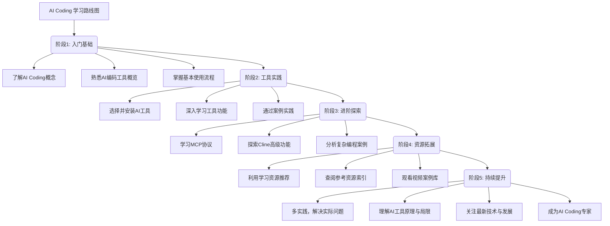

# AI Coding 入门指南

## 概述

AI Coding 是一种利用人工智能技术辅助或自动完成编程任务的方法。AI编码工具可以帮助开发者自动补全代码、生成函数、查找 bug、优化算法等，大大提升开发效率。本指南将帮助您快速了解AI编码的基本概念、工具和使用流程，并提供丰富的学习资源。

为了方便查找和理解，本指南已拆分为多个独立文件，每个文件专注于一个主题。您可以在以下目录中找到详细内容：

## AI Coding 学习路线图



## AI编码工具概览

### 插件类工具
- **GitHub Copilot**：基于 OpenAI 的代码自动补全工具，支持多种编程语言。
- **Tabnine**：AI 驱动的代码补全插件，支持主流 IDE。
- **Kite**：为 Python 等语言提供智能代码补全。
- **Cline**：开源可定制化插件，支持 DeepSeek 等国产模型，适合预算有限的开发者。
- **通义灵码**：阿里云提供的免费 AI 编程助手，支持多种编程语言和环境，特别适合国内团队。
- **Bolt AI**：适合需要自动化代码补全和生成 API 的开发者，尤其在 Web 开发和数据处理领域表现出色。

### 软件类工具
- **ChatGPT**：可以通过自然语言与 AI 交流，获取代码建议、调试帮助等。
- **Cursor**：基于 VS Code 深度优化，支持多模态编程、代码差异可视化，适合全栈开发和复杂系统设计。
- **Trae**：完全免费的 AI 编程工具，对中文指令理解准确率较高，适合个人开发者和初创团队。

## 核心文档目录

### 基础篇
- [AI编码工具介绍](#AI编码工具概览) - 主流AI编码工具及其特点
- [AI编码工具对比](doc/comparison.md) - 2025年工具性能与适用场景对比
- [基本使用流程](#快速入门) - 快速掌握AI编码工具使用步骤
- [学习建议](#学习建议) - 高效学习策略与注意事项

### MCP专题
- [MCP 核心工具指南](doc/mcp/mcp.md) - MCP工具的安装和使用详解
- [MCP 高级功能特性](doc/mcp/cline-features.md) - 高级功能使用指南

### 资源集合
- [学习资源推荐](doc/resources.md) - GitHub项目/B站UP主/微信公众号等资源
- [参考资源索引](doc/references.md) - 官方文档和相关链接
- [视频案例库](doc/videos.md) - 通过视频案例直观了解AI编码应用

### 进阶实践
- [GitHub Copilot教育版申请](doc/copilot-guide.md) - 免费获取高级功能指南
- [Todo App开发全流程](doc/example.md) - AI辅助编程完整案例解析


## 快速入门

1. **选择工具**：根据你的开发环境选择合适的AI工具，推荐使用GitHub Copilot（适用于VS Code）或Trae（完全免费，对中文指令理解准确率较高）。不建议使用问答方式的AI Coding工具，因为它们可能不够专注于代码生成和补全。
2. **安装插件或工具**  
   根据开发环境选择合适的 AI 编码插件（如 VSCode、PyCharm 等）。

3. **编写代码**  
   在编辑器中输入代码，AI 工具会自动给出补全建议或代码片段。

4. **与 AI 交互**  
   可以通过自然语言描述需求，让 AI 生成代码或解释代码逻辑。

5. **代码审核与优化**  
   AI 生成的代码需由开发者审核，确保其正确性和安全性。

## 常见问题

- **AI生成的代码是否可靠？** AI代码需要开发者审核，可能存在逻辑错误或安全隐患。
- **AI工具是否免费？** 部分工具提供免费版本，但高级功能通常需要付费订阅。
- **如何选择合适的AI工具？** 根据你的编程语言、开发环境和预算选择工具，参考 [AI编码工具对比](doc/comparison.md)。

## 学习建议

- **多实践**：多尝试用 AI 工具解决实际编程问题，积累经验。
- **理解原理**：了解 AI 编码工具的基本原理和局限性，避免盲目依赖。
- **持续学习**：关注 AI 编码领域的新技术和新工具，提升自身能力。

## 项目结构

本项目的文档主要集中在 `doc/` 目录下，结构如下：

```
.
├── README.md
└── doc/
    ├── comparison.md           # AI编码工具对比
    ├── copilot-guide.md        # GitHub Copilot教育版申请指南
    ├── example.md              # AI编程流程案例分析
    ├── references.md           # 外部参考资源
    ├── resources.md            # 学习资源推荐
    ├── tips.md                 # 学习建议 (已整合到README.md)
    ├── tools.md                # AI编码工具介绍 (已整合到README.md)
    ├── videos.md               # AI Coding视频案例
    ├── workflow.md             # 基本使用流程 (已整合到README.md)
    └── mcp/
        ├── cline-features.md   # Cline功能全解析
        └── mcp.md              # MCP协议指南
```

---

欢迎使用本项目，开启你的 AI 编码之旅！
