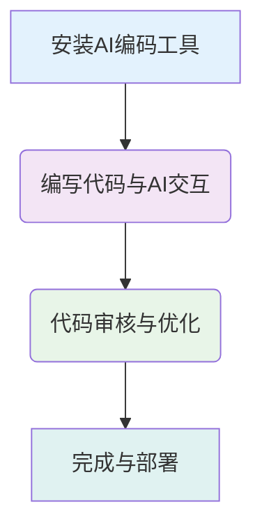

  
  
  

# AI编码高效工作流：从入门到精通的实践路径 🚀

## 概述

本指南旨在为您提供一套清晰、高效的AI编码工作流程，帮助您从零开始，逐步掌握如何将AI工具融入日常开发实践。通过遵循这些步骤，您将能够充分利用AI的强大能力，**简化开发流程**、**提升代码质量**和**加速项目迭代**，最终成为一名高效的智能编程高手。

> 🎯 **核心价值**：本工作流将指导您系统性地利用AI工具，将繁琐的编码任务自动化，让您更专注于创新和解决核心业务问题。

## AI编码基本使用流程

1.  **安装插件或工具**  
    根据您的开发环境和个人偏好，选择并安装合适的AI编码插件（如**GitHub Copilot**、**通义灵码**、**Cline**等）或独立AI编码工具（如**Cursor**）。确保工具已正确配置并与您的IDE集成。

2.  **编写代码与AI交互**  
    在编辑器中输入代码时，AI工具会**实时给出智能补全建议**、**生成代码片段**或**提供整函数生成**。您也可以通过**自然语言描述您的需求**，让AI生成相应的代码逻辑、函数或组件。积极与AI进行对话，明确您的意图。

3.  **代码审核与优化**  
    AI生成或辅助的代码并非总是完美的。开发者需要对AI提供的代码进行**严格的审核**，确保其**正确性**、**安全性**、**可读性**和**符合项目规范**。同时，利用AI的解释和重构能力，对现有代码进行**优化和改进**。

4.  **完成与部署**  
    在代码经过充分审核和优化后，将其集成到您的项目中。AI工具还可以辅助进行**单元测试生成**、**代码审查**等，进一步保障代码质量。最终，完成项目构建并进行部署。

---

*🔄 最后更新：2025年6月2日 | 👨‍💻 作者：AI Coding Team*

