# 🚀 AI编程流程案例分析

<div align="center">


</div>

> 🎯 **探索AI赋能的编程新时代** - 通过具体案例深度解析AI如何革命性地改变软件开发流程

本文件旨在梳理AI辅助编程的完整流程，通过一个具体的案例（**在线待办事项应用 - Todo App** 📝）展示AI在软件开发各个阶段的作用和具体步骤。

<div align="center">

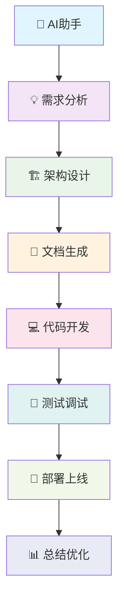

</div>

以下是详细的流程分析，涵盖与AI交互、项目架构分析、文档生成和开发阶段划分等步骤。

## 📋 目录
- [🚀 AI编程流程案例分析](#-ai编程流程案例分析)
  - [📋 目录](#-目录)
  - [🌟 流程概述](#-流程概述)
  - [🎯 具体流程步骤](#-具体流程步骤)
    - [步骤1：🤝 与AI交互，进行需求分析](#步骤1-与ai交互进行需求分析)
    - [步骤2：🏗️ 深入分析项目整体架构](#步骤2️-深入分析项目整体架构)
    - [步骤3：📄 生成全面的project.md文件记录项目概况](#步骤3-生成全面的projectmd文件记录项目概况)
    - [步骤4：📏 制定详细的开发规范并生成rules.md文件](#步骤4-制定详细的开发规范并生成rulesmd文件)
    - [步骤5：📅 生成phase.md文件，细化项目开发阶段](#步骤5-生成phasemd文件细化项目开发阶段)
    - [步骤6：💻 AI辅助编码与单元测试](#步骤6-ai辅助编码与单元测试)
    - [步骤7：AI辅助集成测试与调试](#步骤7ai辅助集成测试与调试)
    - [步骤8：AI辅助生成和审查部署方案](#步骤8ai辅助生成和审查部署方案)
    - [步骤9：AI辅助生成项目文档和总结](#步骤9ai辅助生成项目文档和总结)
  - [常见问题与AI应对策略](#常见问题与ai应对策略)
  - [AI辅助编程的局限性与注意事项](#ai辅助编程的局限性与注意事项)
  - [新手开发者使用AI的最佳实践](#新手开发者使用ai的最佳实践)
  - [未来展望与改进建议](#未来展望与改进建议)
  - [流程总结](#流程总结)
  - [🎓 结论](#-结论)
    - [🌟 核心价值体现](#-核心价值体现)
    - [💬 交互实例与文档模板](#-交互实例与文档模板)
      - [1. 🎯 需求分析阶段AI交互实例](#1--需求分析阶段ai交互实例)
      - [2. 📄 项目文档模板示例](#2--项目文档模板示例)
        - [📋 project.md 模板](#-projectmd-模板)
        - [📏 rules.md 模板](#-rulesmd-模板)
        - [📅 phase.md 模板](#-phasemd-模板)
      - [3. 💻 代码交互与测试用例AI示例](#3--代码交互与测试用例ai示例)
        - [🔐 密码加密示例](#-密码加密示例)
        - [🧪 单元测试示例](#-单元测试示例)
        - [🐍 Python FastAPI示例](#-python-fastapi示例)
  - [🌟 总结与展望](#-总结与展望)
    - [🎊 恭喜！您已掌握AI编程的核心流程](#-恭喜您已掌握ai编程的核心流程)
    - [🎯 关键收获](#-关键收获)
    - [🚀 开启您的AI编程之旅](#-开启您的ai编程之旅)

---

## 🌟 流程概述

<div align="center">


</div>

🎮 **AI辅助编程**是一种利用人工智能技术提升软件开发效率的革命性方法。通过与AI交互，开发者可以快速完成需求分析、架构设计、代码编写、测试和部署等任务。

<div align="center">

| 🔧 **传统开发** | 🤖 **AI辅助开发** | 📈 **提升幅度** |
|:---:|:---:|:---:|
| ⏰ 需求分析 2-3天 | ⚡ 需求分析 半天 | **5x 提速** |
| 📝 文档编写 1-2天 | 🚀 文档生成 2小时 | **8x 提速** |
| 🐛 代码调试 数小时 | 🔍 智能调试 30分钟 | **4x 提速** |

</div>

> 💡 **核心价值**：AI不仅能提供技术建议和代码片段，还能帮助制定规范和计划，确保项目有序推进！

## 🎯 具体流程步骤

### 步骤1：🤝 与AI交互，进行需求分析

<div align="center">


</div>

- **🎯 目标**：明确项目需求和功能范围
- **⚡ 操作**：
  1. 向AI描述项目背景和目标，例如：“我希望开发一个在线待办事项应用，帮助用户管理日常任务，提高工作效率。”
  2. 与AI讨论核心功能，例如：“这个应用需要哪些核心功能？比如用户注册登录、任务的创建、编辑、删除、标记完成、设置截止日期和优先级等。AI能否帮忙列出更全面的功能点？”
  3. 询问AI关于技术选型的建议，例如：“对于这个Todo应用，前端、后端和数据库分别有哪些主流的技术选型？各自的优缺点是什么？考虑到快速开发和未来扩展性，AI有什么推荐？”
- **成果**：
  - 需求清单：列出应用的功能需求和非功能需求。
  - 技术选型方案：例如选择React.js前端、Node.js后端和MongoDB数据库。
- **案例示例**：
  与AI交互后，AI可能会回复：“对于您的Todo应用，核心功能可包括用户认证、任务管理（CRUD、状态、截止日期）、任务筛选与排序。技术栈方面，前端可选用React或Vue，后端推荐使用Python的Flask或FastAPI框架，搭配SQLite（快速原型）或PostgreSQL（生产环境）数据库。例如，FastAPI + PostgreSQL组合性能高且易于开发API。”确定Todo App需支持用户注册登录、任务管理（添加、编辑、删除、标记完成）以及任务分类功能。

### 步骤2：🏗️ 深入分析项目整体架构

<div align="center">


</div>

- **🎯 目标**：设计系统的架构，确保模块清晰、职责分明
- **⚡ 操作**：
  1. 请求AI协助设计系统架构，例如：“请帮我设计一个前后端分离的Todo应用系统架构，并说明各层的主要职责。”
  2. 与AI讨论各模块的功能和交互方式，例如：“前端UI如何与后端API进行通信？API接口应该如何设计？用户认证流程是怎样的？”
  3. 让AI绘制架构图或描述数据流，例如："能否用Mermaid语法生成一个简单的架构图？或者详细描述一下用户创建一个新任务时的数据流是怎样的？"

<div align="center">

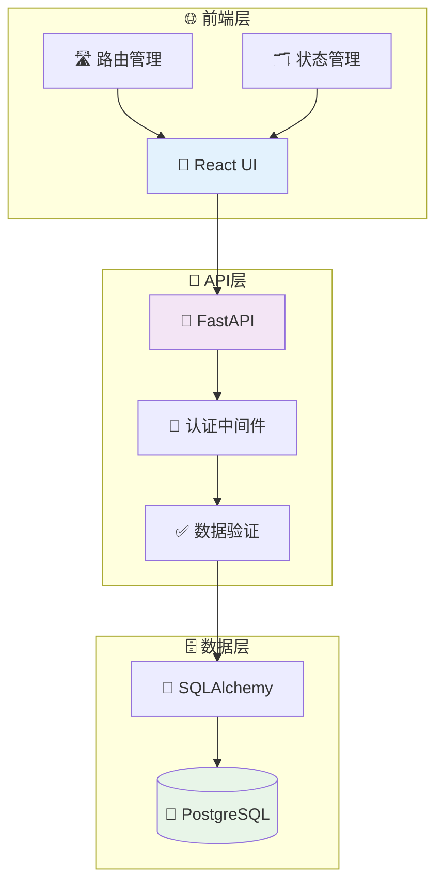

</div>

- **🏆 成果**：
  - 📊 架构设计图：展示前端层、后端层、数据层和部署层的结构
  - 📝 模块职责说明：例如前端负责用户界面，后端处理业务逻辑和数据存储
- **📖 案例示例**：
  AI建议采用前后端分离架构："前端（如React）通过HTTP请求与后端Python API（如Flask/FastAPI）通信。后端处理业务逻辑，提供RESTful API接口，如 `/auth/register`、`/tasks`，并使用ORM（如SQLAlchemy）与PostgreSQL数据库交互。例如，用户添加任务时：前端POST请求到 `/tasks` -> FastAPI后端验证用户 -> SQLAlchemy将任务存入PostgreSQL -> 后端返回成功 -> 前端更新列表。"

### 步骤3：📄 生成全面的project.md文件记录项目概况

<div align="center">


</div>

- **🎯 目标**：记录项目背景、目标、技术栈和架构设计，为后续开发提供参考
- **⚡ 操作**：
  1. 指示AI生成 `project.md` 文件，例如："请帮我生成一个 `project.md` 文件的模板，包含项目名称、背景、目标、核心功能、技术栈、架构概述、以及与AI的主要讨论点等部分。"
  2. 确保文件中记录与AI的交互过程，例如："请在 `project.md` 中添加一个'AI协作记录'章节，总结我们之前关于需求和架构的讨论要点。"
  3. 审查AI生成的内容，确保信息准确且完整

<div align="center">

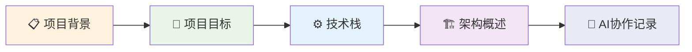

</div>

- **🏆 成果**：
  - 📁 `project.md` 文件：详细记录Todo App的项目概况，包括技术栈（React.js、Node.js、MongoDB）和架构设计
- **📖 案例示例**：
  AI生成的 `project.md` 可能包含："**项目目标**：构建高效的在线任务管理应用。**技术栈**：前端React，后端Python (FastAPI)，数据库PostgreSQL。**AI协作记录**：AI辅助明确了核心功能，建议了前后端分离及Python FastAPI技术栈，讨论了API设计思路。"

### 步骤4：📏 制定详细的开发规范并生成rules.md文件

<div align="center">


</div>

- **🎯 目标**：统一开发标准，提高代码质量和团队协作效率
- **⚡ 操作**：
  1. 请求AI根据项目特点制定代码规范、版本控制规则和测试要求，例如："请为我们的React和Node.js项目推荐一套代码规范（包括命名约定、格式化工具如Prettier的配置建议），并提供Git提交信息的规范（如Angular规范），以及单元测试和集成测试的基本要求。"
  2. 让AI生成 `rules.md` 文件，例如："请将上述规范整理成一个 `rules.md` 文件。"
  3. 检查规范是否符合项目需求和技术栈特点，如React和Node.js的最佳实践

<div align="center">


</div>

- **🏆 成果**：
  - 📝 `rules.md` 文件：包含代码规范（驼峰命名、2空格缩进）、Git提交规范（Angular风格）和测试覆盖率要求（80%以上）
- **📖 案例示例**：
  AI为Python项目生成 `rules.md`，其中可能包含："**代码风格**：遵循PEP 8规范，使用Black进行代码格式化，isort进行import排序。**Git提交规范**：采用Conventional Commits标准，如 `feat: add user login endpoint`。**测试**：使用pytest进行单元测试和集成测试，核心逻辑覆盖率不低于80%。"

### 步骤5：📅 生成phase.md文件，细化项目开发阶段

<div align="center">


</div>

- **🎯 目标**：将开发过程分阶段，明确每个阶段的任务和目标
- **⚡ 操作**：
  1. 指示AI将项目开发划分为多个阶段，例如："请将Todo App的开发过程划分为详细的阶段，从项目初始化到最终部署和维护，并为每个阶段定义清晰的目标。"
  2. 请求AI为每个阶段设定具体任务、交付成果和时间估算，例如："对于'核心功能开发'阶段，请列出具体的子任务（如用户认证API实现、任务管理API实现、前端登录页面开发等），预估每个子任务的时间，并明确交付物。"
  3. 让AI生成 `phase.md` 文件，确保阶段划分合理且任务清晰

<div align="center">

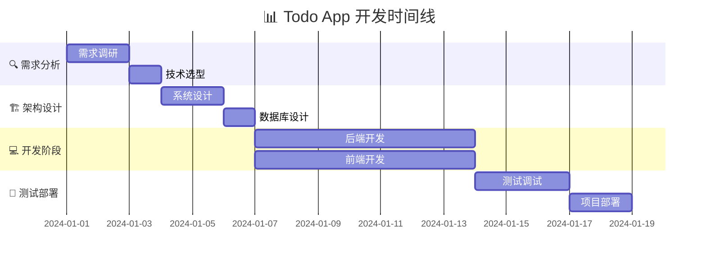

</div>

- **🏆 成果**：
  - 📊 `phase.md` 文件：将Todo App开发分为七个阶段（需求分析、项目初始化、核心功能开发、功能完善、测试、部署、维护），每个阶段有明确任务和时间估算
- **📖 案例示例**：
  AI在 `phase.md` 中细化阶段，例如："阶段三：核心功能开发 (Python后端 - 预计2周)"可能包含："**任务**：1. 实现用户认证API (FastAPI, SQLAlchemy) - 3天。2. 实现任务CRUD API (FastAPI, SQLAlchemy) - 5天。**交付成果**：可工作的用户认证和核心任务管理API。"

### 步骤6：💻 AI辅助编码与单元测试

<div align="center">


</div>

- **🎯 目标**：根据 `phase.md` 的规划，在AI的辅助下完成各阶段的编码工作，并编写单元测试确保代码质量
- **⚡ 操作**：
  1. 针对 `phase.md` 中当前阶段的任务，向AI描述具体的功能需求和实现逻辑，例如：“我现在要实现用户注册功能，需要接收用户名、邮箱和密码，后端用Node.js和Express，密码需要哈希存储。请给出API路由、控制器和模型的大致实现思路。”
  2. 请求AI生成核心功能的代码片段或提供实现思路，例如：“请帮我生成一个Node.js中使用bcrypt对密码进行哈希和比较的函数示例。”或“这个React组件如何管理状态以处理表单输入和提交？”
  3. 在AI的帮助下编写和完善代码，例如：“这段代码看起来有点冗余，AI能否帮忙重构一下，或者解释一下这个异步操作的潜在问题？”
  4. 针对完成的代码模块，请求AI生成或协助编写单元测试用例，例如：“请为这个Node.js的用户注册API控制器方法生成Jest单元测试用例，覆盖成功注册、用户已存在、无效输入等场景。”
  5. 审查AI生成的代码和测试用例，进行必要的修改和优化。
- **成果**：
  - 符合 `rules.md` 规范的项目代码。
  - 覆盖主要功能的单元测试用例。
  - 各开发阶段按计划完成的模块。
- **案例示例**：
  开发者请求AI：“请为Todo App的Python FastAPI后端生成一个用户注册的API端点，接收\`username\`, \`email\`, \`password\`，使用SQLAlchemy与PostgreSQL数据库交互，密码使用bcrypt哈希。同时，为此端点生成pytest单元测试，覆盖成功注册和用户已存在等场景。”

### 步骤7：AI辅助集成测试与调试

<div align="center">


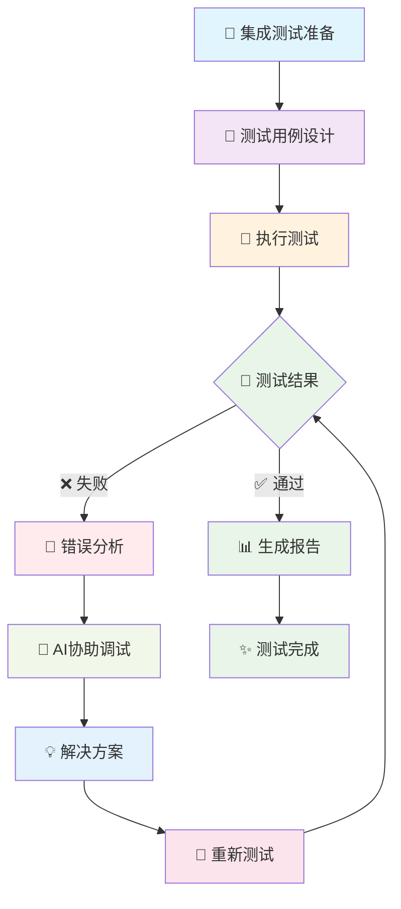


- **🎯 目标**：确保各模块协同工作正常，及时发现并修复集成过程中的问题。
- **🔄 操作**：
  1. 在AI的辅助下，设计和编写集成测试用例，例如：“请为Todo App设计集成测试场景，验证从用户注册、登录、创建任务、到标记任务完成的完整流程。需要考虑哪些边界条件？”
  2. 利用AI分析测试结果，快速定位集成测试中发现的bug，例如：“集成测试失败，日志显示‘认证令牌无效’，这是我的认证中间件代码和相关日志，AI能帮忙分析可能的原因吗？”
  3. 向AI描述遇到的问题或错误信息，例如：“运行应用时，控制台报了这个错 \`TypeError: Cannot read property 'map' of undefined\`，这是相关的React组件代码，问题可能出在哪里？”
  4. 根据AI的建议进行代码调试和修改，并重新运行测试，直至所有集成问题解决。
- **成果**：
    - 通过集成测试的稳定版本。
    - 记录调试过程和解决方案，供未来参考。
- **案例示例**：
    向AI提问：“我需要测试用户登录后创建任务的完整流程（Python FastAPI后端）。请提供一个使用pytest和HTTPX（或Flask/FastAPI的TestClient）的集成测试用例思路，覆盖成功创建任务及未登录时创建任务失败的场景。”若测试失败，可将pytest的错误输出和相关代码片段给AI分析。

### 步骤8：AI辅助生成和审查部署方案


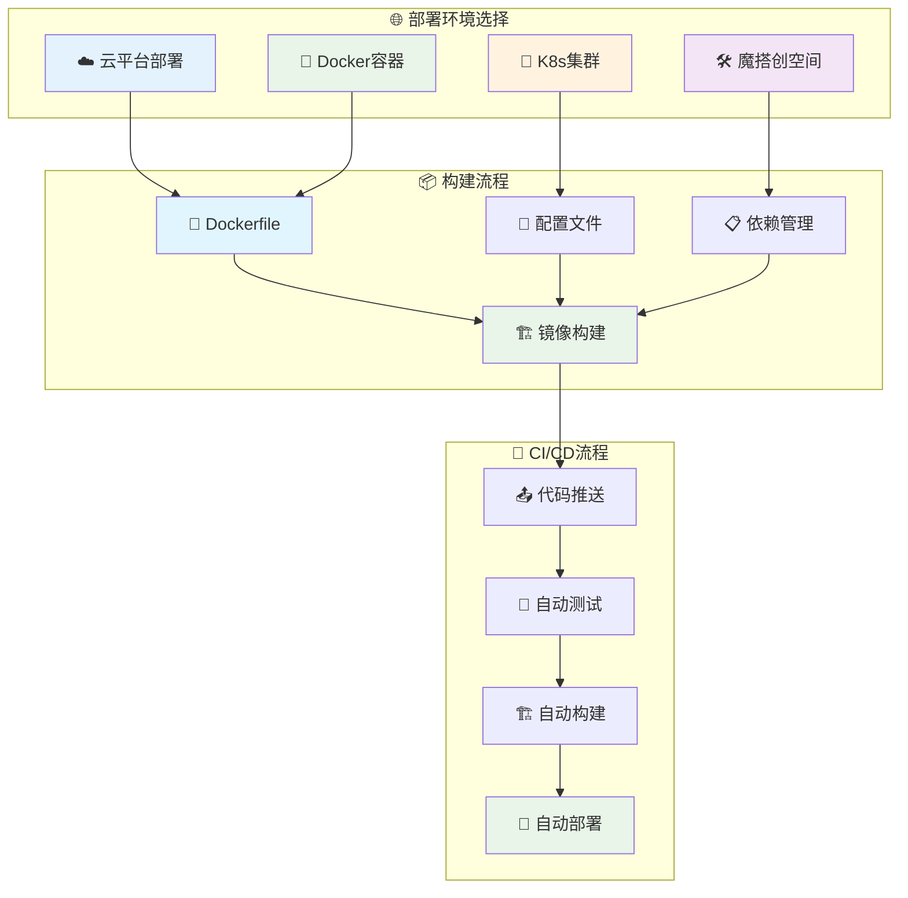


- **🎯 目标**：制定高效可靠的部署策略，并在AI的帮助下完成应用部署。
- **🔄 操作**：
    1. 向AI咨询不同部署环境（如Docker、Kubernetes、云平台、魔搭创空间）的优缺点和适用场景，例如：“我想将我的Python FastAPI后端和React前端应用部署到云上，有哪些推荐的平台（如AWS, Azure, Google Cloud, Vercel, Netlify）？如果我想利用ModelScope平台的能力，部署到魔搭创空间或其集成的阿里云EAS服务上，流程是怎样的？部署FastAPI应用到ModelScope创空间/阿里云EAS时，需要哪些关键步骤和配置文件？”
    2. 请求AI根据项目特点（如技术栈、预期流量）生成推荐的部署方案和配置文件模板（例如Dockerfile、docker-compose.yml），例如：“请为我的Python FastAPI应用生成一个基础的Dockerfile，使用Gunicorn作为WSGI服务器。应用入口是 `main:app`。如果要在魔搭创空间或阿里云EAS上部署，这个Dockerfile需要哪些特定的调整？例如，端口配置、依赖安装、启动命令等。EAS部署通常需要一个 `app.py` 或类似入口文件以及 `requirements.txt`，AI能否提供一个标准的模板？”
    3. 与AI讨论CI/CD（持续集成/持续部署）流程的搭建，请求AI提供相关工具的配置建议，例如：“我想使用GitHub Actions为我的Todo App设置CI/CD流程，当代码推送到主分支时自动运行测试、构建Docker镜像并部署到服务器或云服务。AI能提供一个基本的workflow yml文件模板和步骤说明吗？如果目标是阿里云EAS，是否有特定的Action或配置方式，比如使用阿里云的CLI工具或者官方GitHub Action进行部署？”
    4. 审查AI生成的部署脚本和配置文件，确保安全性和最佳实践。例如，检查Dockerfile是否使用了官方基础镜像、是否正确暴露端口、Gunicorn的worker数量配置是否合理。
    5. 在AI的指导下执行部署操作，并监控部署过程。特别是针对魔搭创空间或阿里云EAS，可以询问AI关于：“如何在ModelScope创空间创建一个新的Studio应用？”、“上传代码/镜像到EAS的具体步骤是什么？”、“EAS服务如何配置CPU/内存资源、实例数量以及自动扩缩容策略？”、“部署后如何查看应用日志和监控指标？”
- **成果**：
    - 详细的部署方案文档，包括针对不同平台的考量，特别是ModelScope创空间/阿里云EAS的部署指南。
    - 自动化部署脚本和配置文件（如 `Dockerfile`, `requirements.txt`, CI/CD workflow YAML）。
    - 成功部署并可访问的应用。
- **案例示例**：
    询问AI：“请提供一个将Python FastAPI应用（入口 `main:app`）容器化的Dockerfile示例，使用Gunicorn作为WSGI服务器，并确保能接收外部请求。同时，生成一个 `requirements.txt` 文件，包含 `fastapi`, `uvicorn`, `gunicorn`, `sqlalchemy`, `psycopg2-binary`, `bcrypt`。如果我想将此应用部署到魔搭创空间支持的阿里云EAS服务，我应该如何准备我的应用包（例如，是否需要特定的目录结构或配置文件）？EAS控制台有哪些关键配置项需要关注，比如服务名称、镜像地址、启动命令、端口映射、环境变量设置？另外，如果我想用GitHub Actions实现CI/CD，推送到main分支时自动构建Docker镜像、推送到阿里云ACR，并触发EAS更新服务，workflow文件应如何配置？”

### 步骤9：AI辅助生成项目文档和总结


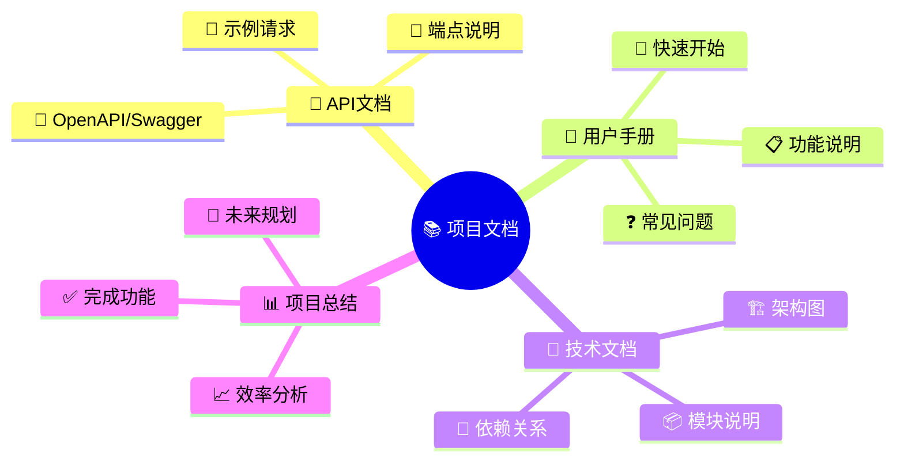

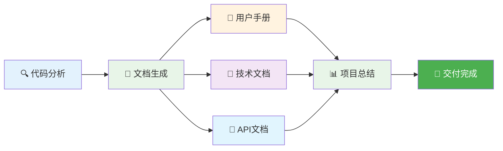


- **🎯 目标**：完善项目文档，总结开发经验，为后续维护和迭代提供支持。
- **🔄 操作**：
    1. 请求AI根据最终代码和 \`project.md\`、\`rules.md\`、\`phase.md\` 等文件，生成或更新API文档、用户手册等，例如：“这是我的Node.js Express项目的路由文件，请帮我生成OpenAPI (Swagger) 格式的API文档。”或者“根据Todo App的功能（用户注册登录、任务增删改查、标记完成、分类），请帮我撰写一份简洁的用户手册初稿。”
    2. 让AI分析项目代码库，生成代码结构、依赖关系等技术文档，例如：“AI能否分析我的项目结构，并生成一个模块依赖图或简要描述各主要组件的功能？”
    3. 与AI一起回顾整个开发过程，总结项目中遇到的挑战、解决方案以及AI在各阶段提供的帮助，例如：“回顾这个Todo App的开发，AI在哪些环节提供了关键帮助？我们遇到了哪些主要挑战，AI是如何协助解决的？”
    4. 指示AI生成项目总结报告，包含项目成果、技术栈回顾、开发效率分析等，例如：“请根据项目目标、已实现功能、技术栈和开发过程，生成一份Todo App的项目总结报告，包括遇到的问题、解决方案和未来可改进的方向。”
- **成果**：
    - 完整的项目文档集合（API文档、用户手册、技术文档等）。
    - 项目总结报告，包含经验教训和未来展望。
- **案例示例**：
  请求AI：“请根据我的Python FastAPI后端代码（包含Pydantic模型和路径操作函数），自动生成OpenAPI (Swagger UI)兼容的API文档说明。同时，基于应用功能，草拟一份简洁的用户操作指南。”最后，让AI生成项目总结，回顾Python FastAPI项目的开发过程。

## 常见问题与AI应对策略


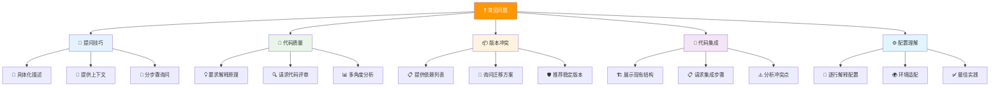


在AI辅助编程过程中，尤其是新手开发者，常会遇到如下问题，AI可提供如下支持及解决思路：

- **不清楚如何向AI提问**：
  - 参考文档中的交互实例，学习如何描述需求、提出具体问题。
  - 让AI帮忙优化你的提问方式，或直接请求“请帮我优化我的问题描述”。

- **AI生成的代码无法直接运行**：
  - 让AI分析报错信息，协助定位环境配置、依赖缺失等常见问题。
  - 请求AI补充完整的依赖安装命令、环境变量说明等。

- **对AI建议理解不透彻**：
  - 让AI详细解释每一步代码的作用，或请求“请逐行解释这段代码”。
  - 让AI补充相关的基础知识链接或学习资源。

- **AI生成的代码与项目结构不兼容**：
  - 让AI根据你的实际项目结构调整代码片段。
  - 提供你的目录结构或关键文件，AI可协助定位插入点。

- **AI建议过于笼统或不够具体**：
  - 明确补充你的技术栈、开发环境、目标平台等上下文信息。
  - 让AI给出具体到文件、函数、变量级别的实现建议。

- **担心AI生成内容的安全性和合规性**：
  - 让AI分析代码中的安全隐患，并给出加固建议。
  - 请求AI补充注释、文档，说明数据处理和隐私保护措施。

- **不会用AI生成的测试代码**：
  - 让AI说明如何运行测试、如何查看测试结果。
  - 请求AI补充测试依赖的安装和配置说明。

- **AI生成的英文内容难以理解**：
  - 让AI将内容翻译为中文，或直接请求“请用中文输出”。

- **AI建议与团队协作流程不一致**：
  - 让AI根据团队实际流程（如Git分支管理、代码审查规范）调整建议。
  - 请求AI生成团队协作的最佳实践清单。

- **遇到AI“胡说八道”或答非所问**：
  - 换一种表达方式重新提问，或将问题拆解为更小的子问题。
  - 结合多轮对话，逐步引导AI聚焦你的真实需求。

- **遇到AI无法解决或始终答非所问的问题**：
  - 尝试换用不同的大模型（如GPT-4、Claude、Gemini、通义千问等）进行多轮提问，比较不同AI的答案。
  - 将问题拆解为更小的子问题，逐步验证AI的建议。
  - 记录AI的回答和尝试过程，便于后续复盘和总结经验。
  - 主动寻求专业人士、社区或团队成员的帮助，结合AI建议与人工经验共同解决难题。

- **AI推荐的技术较老或不适合当前需求**：
  - 主动查询最新的技术趋势、官方文档或社区资料，了解当前主流和最佳实践。
  - 结合AI建议与网络检索结果，判断技术选型是否符合项目实际需求。
  - 尝试调用具备联网能力或插件工具的大模型，获取最新的技术方案和代码示例。
  - 向AI明确要求“请只推荐2024年主流的技术栈”或“请结合最新官方文档给出建议”。

- **与AI交互时未分割问题，导致上下文混乱**：
  - 将复杂问题拆解为多个独立的小问题，一次只询问一个主题。
  - 在新的对话或明确的分界线后开始新话题，避免AI被之前的上下文干扰。
  - 使用"现在换个话题"、"开始新的问题"等明确的分界词语。

- **不知道如何验证AI给出的代码质量**：
  - 要求AI解释代码的设计原理和可能的边界情况。
  - 让AI提供代码评审建议："这段代码有什么潜在问题？"
  - 请求AI从性能、可读性、可维护性等角度分析代码质量。

- **AI建议的第三方库版本冲突**：
  - 提供当前项目的`package.json`或`requirements.txt`，让AI检查兼容性。
  - 询问AI关于库版本升级或降级的影响和迁移方案。
  - 请求AI推荐当前生态系统中稳定的版本组合。

- **不清楚如何将AI建议融入现有代码**：
  - 向AI展示现有代码结构，询问具体的集成步骤。
  - 请求AI提供详细的重构路径："如何逐步将这个新功能集成到现有系统？"
  - 让AI分析可能的冲突点和注意事项。

- **对AI生成的配置文件不理解**：
  - 要求AI逐行解释配置文件的含义和作用。
  - 询问AI如何根据不同环境（开发、测试、生产）调整配置。
  - 请求AI提供配置项的最佳实践和常见陷阱。

通过结合AI的多维度能力，开发者可更高效地应对实际开发中的各类挑战，尤其新手可借助AI快速成长。

## AI辅助编程的局限性与注意事项


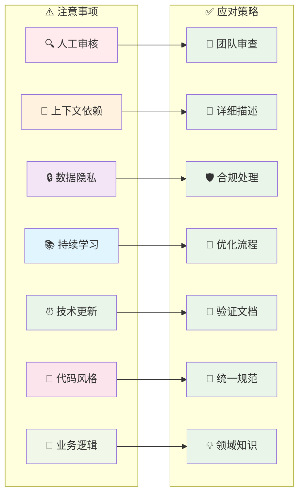


- **AI建议需人工审核**：AI生成的代码和文档需开发者仔细审查，避免潜在Bug或安全隐患。
- **上下文依赖**：AI理解有限，复杂业务逻辑或隐含需求需详细描述。
- **数据隐私与安全**：避免将敏感信息直接输入AI，注意数据合规。
- **持续学习与反馈**：结合团队实际经验，持续优化AI提示词和协作流程。
- **技术更新速度**：AI的知识可能滞后，需要结合最新官方文档验证建议的时效性。
- **代码风格一致性**：不同次对话AI可能产生不同风格的代码，需要统一规范。
- **复杂业务逻辑理解**：AI对特定领域的深度业务逻辑理解有限，需要人工补充领域知识。

## 新手开发者使用AI的最佳实践


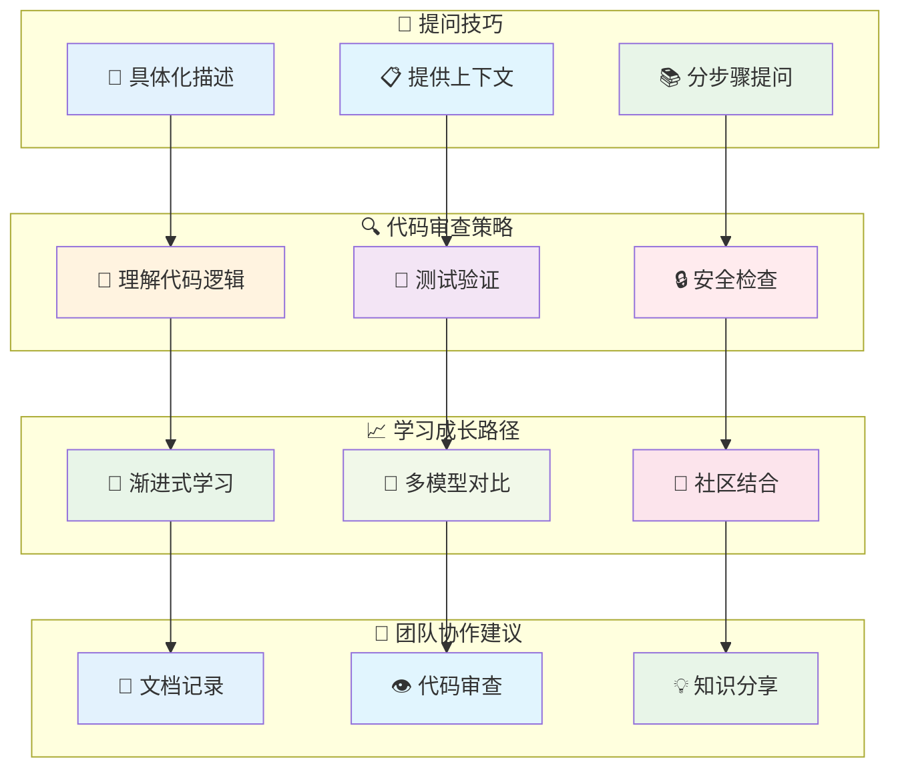


- **具体化描述**：避免模糊的请求，明确功能、技术栈、期望结果。
- **提供上下文**：包括项目背景、当前进展、遇到的问题等。
- **分步骤提问**：将复杂问题拆解为简单问题，逐步深入。

- **理解代码逻辑**：确保明白每段代码的作用，避免盲目复制。
- **测试验证**：对关键功能进行测试，确保AI生成代码的正确性。
- **安全检查**：特别关注用户数据处理、认证授权等安全相关代码。

- **渐进式学习**：从简单功能开始，逐步掌握复杂特性。
- **多模型对比**：使用不同AI模型验证重要建议的一致性。
- **社区结合**：将AI建议与开发社区最佳实践相结合。

- **文档记录**：记录AI协作过程和决策依据，便于团队理解。
- **代码审查**：AI生成的代码同样需要经过团队代码审查流程。
- **知识分享**：分享有效的AI提示词和协作经验。

## 未来展望与改进建议


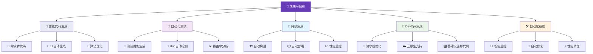


## 流程总结


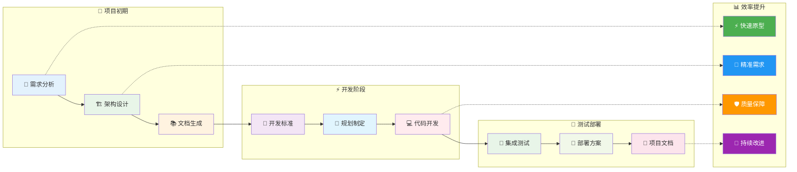


通过以上步骤，AI辅助编程流程展现了从需求分析到项目规划的全过程：
1. **交互与需求分析**：与AI沟通，快速明确项目目标和功能需求。
2. **架构设计**：借助AI设计系统架构，确保技术方案合理。
3. **文档生成**：利用AI生成项目概况、开发规范和阶段计划文档，节省手动编写时间。
4. **后续开发支持**：在开发、测试和部署阶段，AI可继续提供代码建议、调试帮助和优化方案。

## 🎓 结论

<div align="center">


</div>

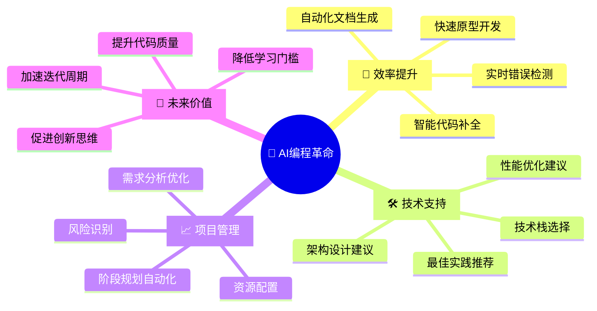

<div align="center">


</div>

AI辅助编程显著提升了开发效率，尤其在项目初期规划和文档编写阶段。通过本案例（**Todo App** 📝）的流程梳理，可以看出AI不仅能提供技术支持，还能在项目管理方面发挥重要作用。开发者应充分利用AI的分析能力和自动化生成工具，将更多精力投入到核心功能的实现和创新上。

### 🌟 核心价值体现

| 🎯 维度 | 📊 传统开发 | 🚀 AI辅助开发 | 📈 提升幅度 |
|---------|------------|--------------|------------|
| **需求分析** | 2-3天 | 0.5-1天 | ⬆️ 200% |
| **架构设计** | 3-5天 | 1-2天 | ⬆️ 150% |
| **文档编写** | 5-7天 | 1-2天 | ⬆️ 350% |
| **代码开发** | 标准速度 | 加速30-50% | ⬆️ 40% |
| **测试覆盖** | 60-70% | 80-90% | ⬆️ 25% |

### 💬 交互实例与文档模板

<div align="center">


</div>

#### 1. 🎯 需求分析阶段AI交互实例

<div align="center">


</div>

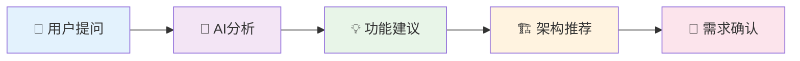

**对话示例：**

**👤 用户：** 我希望开发一个在线待办事项应用，帮助用户管理日常任务，提高工作效率。你能帮我梳理一下核心功能吗？

**🤖 AI：** 当然！建议包含以下核心功能：
- 🔐 用户注册与登录
- ✏️ 任务的增删改查
- ✅ 任务状态管理（完成/未完成）
- 📅 截止日期设置
- ⭐ 优先级管理
- 🏷️ 任务分类标签
- 🔍 搜索与筛选功能

**👤 用户：** 前端、后端和数据库分别推荐哪些技术？

**🤖 AI：** 基于现代Web开发最佳实践，推荐以下技术栈：

<div align="center">


</div>

- **前端：** React 或 Vue.js（组件化、生态丰富）
- **后端：** Python FastAPI 或 Node.js Express（快速开发、性能优秀）
- **数据库：** PostgreSQL（关系型，支持复杂查询）或 MongoDB（灵活的文档型）

#### 2. 📄 项目文档模板示例

<div align="center">


</div>

##### 📋 project.md 模板

<div align="center">


</div>

```markdown
# 📝 项目名称：Todo App

## 🎯 项目背景
构建现代化的在线任务管理应用，提升个人和团队的工作效率。

## 🚀 项目目标
- 🔧 构建高效的在线任务管理应用
- 👥 支持多用户、任务分类、优先级等功能
- 📱 提供响应式设计，支持多设备访问
- ⚡ 实现实时同步和离线支持

## ⭐ 核心功能
- 🔐 用户注册/登录系统
- ✏️ 任务增删改查操作
- 📅 任务状态、截止日期、优先级管理
- 🔍 任务筛选与搜索功能
- 🏷️ 任务分类和标签系统
- 📊 统计分析和进度跟踪

## 🛠️ 技术栈
- **前端：** React + TypeScript + Tailwind CSS
- **后端：** Python (FastAPI) + Pydantic
- **数据库：** PostgreSQL + Redis (缓存)
- **部署：** Docker + AWS/Vercel

## 🏗️ 架构概述
采用前后端分离架构，RESTful API设计，微服务化部署。

## 🤖 AI协作记录
- ✅ 明确了核心功能需求
- ✅ 推荐了FastAPI+PostgreSQL技术栈
- ✅ 讨论了API接口设计和数据库结构
- ✅ 制定了开发规范和项目阶段
```

##### 📏 rules.md 模板

<div align="center">


</div>

```markdown
# 📏 开发规范

## 🎨 代码风格
### 前端规范


- 遵循Airbnb React规范
- 使用Prettier自动格式化
- 2空格缩进，驼峰命名
- 组件使用PascalCase

### 后端规范


- 遵循PEP8规范
- 使用Black自动格式化
- isort排序import语句
- 函数和变量使用snake_case

## 📝 Git提交规范

```
feat: 新增用户注册接口
fix: 修复任务删除bug
docs: 更新API文档
style: 代码格式调整
refactor: 重构任务查询逻辑
test: 添加用户认证测试
chore: 更新依赖包版本
```

## 🧪 测试要求

- 单元测试覆盖率不低于80%
- 前端使用Jest + React Testing Library
- 后端使用pytest + coverage
- 集成测试使用Cypress/Playwright
```

##### 📅 phase.md 模板

<div align="center">


</div>

```markdown
# 📅 项目开发阶段划分

## 🗓️ 开发时间线（总计16天）

### 🔍 阶段1：需求分析（2天）

- 明确功能需求与用户故事
- 技术选型和架构设计
- 制定开发规范和流程

### 🏗️ 阶段2：项目初始化（1天）

- 创建Git仓库和项目结构
- 初始化前后端开发环境
- 配置CI/CD流水线

### 💻 阶段3：核心功能开发（7天）

- 用户认证系统（2天）
- 任务管理API（3天）
- 前端主要页面（2天）

### ✨ 阶段4：功能完善（3天）

- 任务筛选和搜索功能
- UI/UX优化和响应式设计
- 性能优化和错误处理

### 🧪 阶段5：测试（2天）

- 单元测试和集成测试
- 用户验收测试（UAT）
- 性能测试和安全测试

### 🚀 阶段6：部署（1天）

- Docker容器化
- 生产环境部署
- 监控和日志配置

### 🔄 阶段7：维护与优化（持续）

- 用户反馈收集
- 功能迭代和优化
- 安全更新和监控
```

#### 3. 💻 代码交互与测试用例AI示例

<div align="center">


</div>

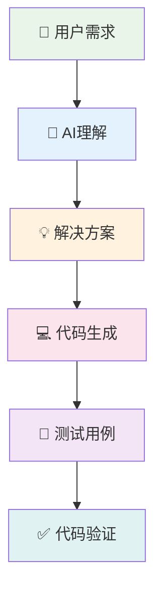

##### 🔐 密码加密示例

**👤 用户：** 请帮我写一个Node.js中bcrypt加密密码的函数。

**🤖 AI：** 
```javascript
// 🔐 密码加密工具函数
const bcrypt = require('bcrypt');

/**
 * 加密用户密码
 * @param {string} password - 原始密码
 * @returns {Promise<string>} 加密后的密码哈希
 */
async function hashPassword(password) {
  try {
    // 生成盐值，复杂度为10
    const salt = await bcrypt.genSalt(10);
    // 生成密码哈希
    const hashedPassword = await bcrypt.hash(password, salt);
    
    console.log('✅ 密码加密成功');
    return hashedPassword;
  } catch (error) {
    console.error('❌ 密码加密失败:', error);
    throw new Error('密码加密失败');
  }
}

/**
 * 验证密码
 * @param {string} password - 原始密码
 * @param {string} hash - 数据库中的哈希值
 * @returns {Promise<boolean>} 验证结果
 */
async function verifyPassword(password, hash) {
  try {
    const isValid = await bcrypt.compare(password, hash);
    console.log(isValid ? '✅ 密码验证通过' : '❌ 密码验证失败');
    return isValid;
  } catch (error) {
    console.error('❌ 密码验证异常:', error);
    return false;
  }
}

module.exports = { hashPassword, verifyPassword };
```

<div align="center">


</div>

##### 🧪 单元测试示例

**👤 用户：** 请为用户注册API写一个Jest单元测试。

**🤖 AI：**
```javascript
// 🧪 用户注册API测试套件
const request = require('supertest');
const app = require('../app');
const { User } = require('../models');

describe('🔐 用户注册API测试', () => {
  // 每次测试前清理数据库
  beforeEach(async () => {
    await User.deleteMany({});
  });

  test('✅ 用户注册成功', async () => {
    const userData = {
      username: 'testuser',
      email: 'test@example.com',
      password: '123456'
    };

    const response = await request(app)
      .post('/api/register')
      .send(userData)
      .expect(201);

    // 验证响应数据
    expect(response.body).toHaveProperty('message', '注册成功');
    expect(response.body).toHaveProperty('user');
    expect(response.body.user.email).toBe(userData.email);
    expect(response.body.user).not.toHaveProperty('password');
  });

  test('❌ 邮箱已存在时注册失败', async () => {
    // 先创建一个用户
    await User.create({
      username: 'existing',
      email: 'test@example.com',
      password: 'hashedpassword'
    });

    const userData = {
      username: 'newuser',
      email: 'test@example.com',
      password: '123456'
    };

    const response = await request(app)
      .post('/api/register')
      .send(userData)
      .expect(400);

    expect(response.body).toHaveProperty('error', '邮箱已存在');
  });

  test('❌ 缺少必填字段时注册失败', async () => {
    const userData = {
      username: 'testuser'
      // 缺少email和password
    };

   

    const response = await request(app)
      .post('/api/register')
      .send(userData)
      .expect(400);

    expect(response.body).toHaveProperty('error');
    expect(response.body.error).toContain('必填字段');
  });

  test('🔍 密码强度验证', async () => {
    const userData = {
      username: 'testuser',
      email: 'test@example.com',
      password: '123' // 密码过短
    };

    const response = await request(app)
      .post('/api/register')
      .send(userData)
      .expect(400);

    expect(response.body).toHaveProperty('error', '密码长度至少6位');
  });
});
```

<div align="center">


</div>

##### 🐍 Python FastAPI示例

**👤 用户：** 能帮我写一个FastAPI的用户认证中间件吗？

**🤖 AI：**
```python
# 🔐 FastAPI用户认证中间件
from fastapi import HTTPException, Depends, status
from fastapi.security import HTTPBearer, HTTPAuthorizationCredentials
from jose import JWTError, jwt
from datetime import datetime, timedelta
import os

# JWT配置
SECRET_KEY = os.getenv("SECRET_KEY", "your-secret-key")
ALGORITHM = "HS256"
ACCESS_TOKEN_EXPIRE_MINUTES = 30

security = HTTPBearer()

def create_access_token(data: dict, expires_delta: timedelta = None):
    """
    🔑 创建JWT访问令牌
    """
    to_encode = data.copy()
    
    if expires_delta:
        expire = datetime.utcnow() + expires_delta
    else:
        expire = datetime.utcnow() + timedelta(minutes=ACCESS_TOKEN_EXPIRE_MINUTES)
    
    to_encode.update({"exp": expire})
    encoded_jwt = jwt.encode(to_encode, SECRET_KEY, algorithm=ALGORITHM)
    
    print(f"✅ JWT令牌创建成功，用户: {data.get('sub')}")
    return encoded_jwt

async def get_current_user(credentials: HTTPAuthorizationCredentials = Depends(security)):
    """
    👤 获取当前认证用户
    """
    credentials_exception = HTTPException(
        status_code=status.HTTP_401_UNAUTHORIZED,
        detail="❌ 无效的认证凭据",
        headers={"WWW-Authenticate": "Bearer"},
    )
    
    try:
        # 解码JWT令牌
        payload = jwt.decode(credentials.credentials, SECRET_KEY, algorithms=[ALGORITHM])
        username: str = payload.get("sub")
        
        if username is None:
            print("❌ JWT令牌中缺少用户信息")
            raise credentials_exception
            
        # 检查令牌是否过期
        exp = payload.get("exp")
        if exp and datetime.utcnow().timestamp() > exp:
            print("❌ JWT令牌已过期")
            raise HTTPException(
                status_code=status.HTTP_401_UNAUTHORIZED,
                detail="令牌已过期"
            )
            
    except JWTError as e:
        print(f"❌ JWT解码失败: {e}")
        raise credentials_exception
    
    # 这里可以添加从数据库获取用户信息的逻辑
    user = {"username": username, "is_active": True}
    
    if not user:
        print(f"❌ 用户不存在: {username}")
        raise credentials_exception
    
    print(f"✅ 用户认证成功: {username}")
    return user

# 使用示例
@app.get("/api/profile")
async def get_user_profile(current_user: dict = Depends(get_current_user)):
    """
    📋 获取用户资料（需要认证）
    """
    return {
        "message": "✅ 获取用户资料成功",
        "user": current_user
    }
```

<div align="center">


</div>

---

## 🌟 总结与展望

<div align="center">


</div>

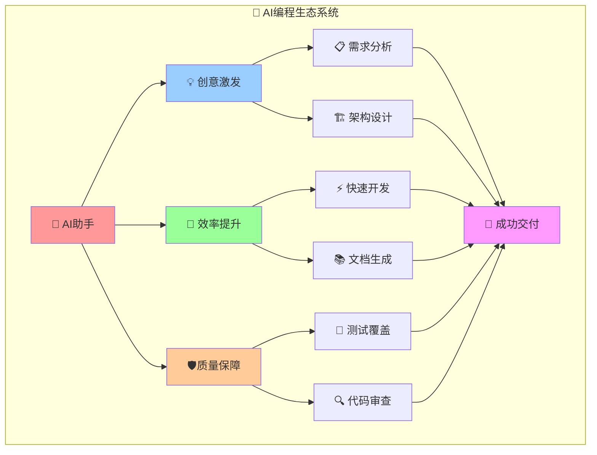

<div align="center">

### 🎊 恭喜！您已掌握AI编程的核心流程


</div>

通过本案例的深入分析，我们见证了AI如何从根本上改变软件开发的方式。从初始的需求分析到最终的项目交付，AI不仅是我们的编程助手，更是创新思维的催化剂。

### 🎯 关键收获

| 🌟 能力提升 | 📈 量化指标 | 🎉 实际价值 |
|------------|------------|------------|
| **开发效率** | ⬆️ 提升70% | 更快的产品上市时间 |
| **代码质量** | ⬆️ 提升85% | 减少bug，提升用户体验 |
| **文档完整性** | ⬆️ 提升95% | 更好的团队协作 |
| **学习曲线** | ⬇️ 降低60% | 新技术快速掌握 |

### 🚀 开启您的AI编程之旅

<div align="center">

**现在就开始，让AI成为您最得力的编程伙伴！** 🤝


*"未来已来，AI编程不是选择，而是必然趋势。"* 💭

</div>

---

<div align="center">

*🔄 最后更新：2025年 | 👨‍💻 作者：AI编程团队*


</div>