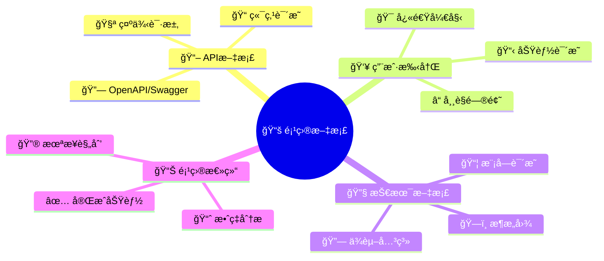
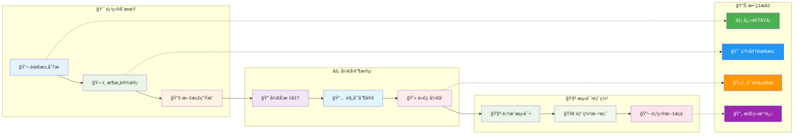
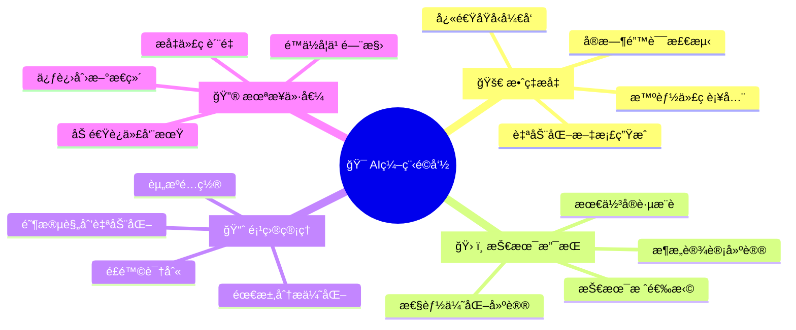
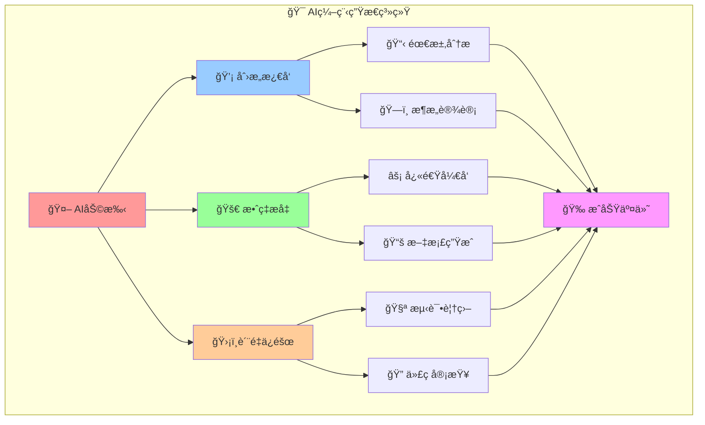

# 🚀 AI编程æµç¨‹æ¡ˆä¾‹åˆ†æ
<div align="center">


</div>

> 🯠**æ¢ç´¢AI赋能的编程新时代** - 通过具体案例深度解æAI如何é©å‘½æ€§åœ°æ”¹å˜è½¯ä»¶å¼€å‘æµç¨‹

本文件旨在梳ç†AI辅助编程的完整æµç¨‹ï¼Œé€šè¿‡ä¸€ä¸ªå…·ä½“的案例（**在线待åŠäº‹é¡¹åº”用 - Todo App** ğŸ“）展示AI在软件开å‘å„个阶段的作用和具体步骤。
以下是详细的æµç¨‹åˆ†æ，涵盖ä¸AI交互ã€é¡¹ç›®æ¶æ„分æã€æ–‡æ¡£ç”Ÿæˆå’Œå¼€å‘阶段划分等步骤。

## 📋 目录
- [🚀 AI编程æµç¨‹æ¡ˆä¾‹åˆ†æ](#-ai编程æµç¨‹æ¡ˆä¾‹åˆ†æ)
  - [📋 目录](#-目录)
  - [🌟 æµç¨‹æ¦‚è¿°](#-æµç¨‹æ¦‚è¿°)
  - [🯠具体æµç¨‹æ­¥éª¤](#-具体æµç¨‹æ­¥éª¤)
    - [步骤1：🤠ä¸AI交互，进行需求分æ](#步骤1-ä¸ai交互进行需求分æ)
    - [步骤2：ğŸ—ï¸ æ·±å…¥åˆ†æ项目整体æ¶æ„](#步骤2ï¸-深入分æ项目整体æ¶æ„)
    - [步骤3：📄 生æˆå…¨é¢çš„project.md文件记录项目概况](#步骤3-生æˆå…¨é¢çš„projectmd文件记录项目概况)
    - [步骤4：📠制定详细的开å‘规范并生æˆrules.md文件](#步骤4-制定详细的开å‘规范并生æˆrulesmd文件)
    - [步骤5：📅 生æˆphase.md文件，细化项目开å‘阶段](#步骤5-生æˆphasemd文件细化项目开å‘阶段)
    - [步骤6：💻 AI辅助编ç ä¸å•å…ƒæµ‹è¯•](#步骤6-ai辅助编ç ä¸å•å…ƒæµ‹è¯•)
    - [步骤7：AI辅助集æˆæµ‹è¯•ä¸è°ƒè¯•](#步骤7ai辅助集æˆæµ‹è¯•ä¸è°ƒè¯•)
    - [步骤8：AI辅助生æˆå’Œå®¡æŸ¥éƒ¨ç½²æ–¹æ¡ˆ](#步骤8ai辅助生æˆå’Œå®¡æŸ¥éƒ¨ç½²æ–¹æ¡ˆ)
    - [步骤9：AI辅助生æˆé¡¹ç›®æ–‡æ¡£å’Œæ€»ç»“](#步骤9ai辅助生æˆé¡¹ç›®æ–‡æ¡£å’Œæ€»ç»“)
  - [常è§é—®é¢˜ä¸AI应对策略](#常è§é—®é¢˜ä¸ai应对策略)
  - [AI辅助编程的局é™æ€§ä¸æ³¨æ„事项](#ai辅助编程的局é™æ€§ä¸æ³¨æ„事项)
  - [新手开å‘者使用AI的最佳å®è·µ](#新手开å‘者使用ai的最佳å®è·µ)
  - [未æ¥å±•æœ›ä¸æ”¹è¿›å»ºè®®](#未æ¥å±•æœ›ä¸æ”¹è¿›å»ºè®®)
  - [æµç¨‹æ€»ç»“](#æµç¨‹æ€»ç»“)
  - [📠结论](#-结论)
    - [🌟 核心价值体ç°](#-核心价值体ç°)
    - [💬 交互å®ä¾‹ä¸æ–‡æ¡£æ¨¡æ¿](#-交互å®ä¾‹ä¸æ–‡æ¡£æ¨¡æ¿)
      - [1. 🯠需求分æ阶段AI交互å®ä¾‹](#1--需求分æ阶段ai交互å®ä¾‹)
      - [2. 📄 项目文档模æ¿ç¤ºä¾‹](#2--项目文档模æ¿ç¤ºä¾‹)
        - [📋 project.md 模æ¿](#-projectmd-模æ¿)
        - [📠rules.md 模æ¿](#-rulesmd-模æ¿)
        - [📅 phase.md 模æ¿](#-phasemd-模æ¿)
      - [3. 💻 代ç äº¤äº’ä¸æµ‹è¯•ç”¨ä¾‹AI示例](#3--代ç äº¤äº’ä¸æµ‹è¯•ç”¨ä¾‹ai示例)
        - [🔠密ç åŠ å¯†ç¤ºä¾‹](#-密ç åŠ å¯†ç¤ºä¾‹)
        - [🧪 å•å…ƒæµ‹è¯•ç¤ºä¾‹](#-å•å…ƒæµ‹è¯•ç¤ºä¾‹)
        - [ğŸ Python FastAPI示例](#-python-fastapi示例)
  - [🌟 总结ä¸å±•æœ›](#-总结ä¸å±•æœ›)
    - [🊠æ­å–œï¼æ‚¨å·²æŒæ¡AI编程的核心æµç¨‹](#-æ­å–œæ‚¨å·²æŒæ¡ai编程的核心æµç¨‹)
    - [🯠关键收è·](#-关键收è·)
    - [🚀 å¼€å¯æ‚¨çš„AI编程之旅](#-å¼€å¯æ‚¨çš„ai编程之旅)

---

## 🌟 æµç¨‹æ¦‚è¿°

<div align="center">


</div>

🮠**AI辅助编程**是一ç§åˆ©ç”¨äººå·¥æ™ºèƒ½æŠ€æœ¯æå‡è½¯ä»¶å¼€å‘效ç‡çš„é©å‘½æ€§æ–¹æ³•ã€‚通过ä¸AI交互，开å‘者å¯ä»¥å¿«é€Ÿå®Œæˆéœ€æ±‚分æã€æ¶æ„设计ã€ä»£ç ç¼–写ã€æµ‹è¯•å’Œéƒ¨ç½²ç­‰ä»»åŠ¡ã€‚

| 🔧 **传统开å‘** | 🤖 **AI辅助开å‘** | 📈 **æå‡å¹…度** |
|:---------------:|:-----------------:|:---------------:|
| Ⱐ需求分æ 2-3天 | âš¡ 需求分æ åŠå¤©   | **5x æ速**     |
| 📠文档编写 1-2天 | 🚀 æ–‡æ¡£ç”Ÿæˆ 2å°æ—¶ | **8x æ速**     |
| 🛠代ç è°ƒè¯• æ•°å°æ—¶ | 🔠智能调试 30分钟 | **4x æ速**     |

> 💡 **核心价值**：AIä¸ä»…能æ供技术建议和代ç ç‰‡æ®µï¼Œè¿˜èƒ½å¸®åŠ©åˆ¶å®šè§„范和计划，确ä¿é¡¹ç›®æœ‰åºæ¨è¿›ï¼

## 🯠具体æµç¨‹æ­¥éª¤

### 步骤1：🤠ä¸AI交互，进行需求分æ


- **🯠目标**：æ˜ç¡®é¡¹ç›®éœ€æ±‚和功能范围
- **âš¡ æ“作**：
  1. å‘AIæ述项目背景和目标，例如：“我希望开å‘一个在线待åŠäº‹é¡¹åº”用，帮助用户管ç†æ—¥å¸¸ä»»åŠ¡ï¼Œæ高工作效ç‡ã€‚â€
  2. ä¸AI讨论核心功能，例如：“这个应用需è¦å“ªäº›æ ¸å¿ƒåŠŸèƒ½ï¼Ÿæ¯”如用户注册登录ã€ä»»åŠ¡çš„创建ã€ç¼–辑ã€åˆ é™¤ã€æ ‡è®°å®Œæˆã€è®¾ç½®æˆªæ­¢æ—¥æœŸå’Œä¼˜å…ˆçº§ç­‰ã€‚AI能å¦å¸®å¿™åˆ—出更全é¢çš„功能点？â€
  3. 询问AIå…³äºæŠ€æœ¯é€‰å‹çš„建议，例如：“对äºè¿™ä¸ªTodo应用，å‰ç«¯ã€å端和数æ®åº“分别有哪些主æµçš„技术选å‹ï¼Ÿå„自的优缺点是什么？考虑到快速开å‘和未æ¥æ‰©å±•æ€§ï¼ŒAI有什么æ¨è？â€
- **🆠æˆæœ**：
  - 需求清å•ï¼šåˆ—出应用的功能需求和é功能需求。
  - 技术选å‹æ–¹æ¡ˆï¼šä¾‹å¦‚选择React.jså‰ç«¯ã€Node.jså端和MongoDBæ•°æ®åº“。
- **📖 案例示例**：
  ä¸AI交互å，AIå¯èƒ½ä¼šå›å¤ï¼šâ€œå¯¹äºæ‚¨çš„Todo应用，核心功能å¯åŒ…括用户认è¯ã€ä»»åŠ¡ç®¡ç†ï¼ˆCRUDã€çŠ¶æ€ã€æˆªæ­¢æ—¥æœŸï¼‰ã€ä»»åŠ¡ç­›é€‰ä¸æ’åºã€‚技术栈方é¢ï¼Œå‰ç«¯å¯é€‰ç”¨React或Vue，å端æ¨è使用Pythonçš„Flask或FastAPI框æ¶ï¼Œæ­é…SQLite（快速åŸå‹ï¼‰æˆ–PostgreSQL（生产ç¯å¢ƒï¼‰æ•°æ®åº“。例如，FastAPI + PostgreSQL组åˆæ€§èƒ½é«˜ä¸”易äºå¼€å‘API。â€ç¡®å®šTodo App需支æŒç”¨æˆ·æ³¨å†Œç™»å½•ã€ä»»åŠ¡ç®¡ç†ï¼ˆæ·»åŠ ã€ç¼–辑ã€åˆ é™¤ã€æ ‡è®°å®Œæˆï¼‰ä»¥åŠä»»åŠ¡åˆ†ç±»åŠŸèƒ½ã€‚

### 步骤2：ğŸ—ï¸ æ·±å…¥åˆ†æ项目整体æ¶æ„


- **🯠目标**：设计系统的æ¶æ„，确ä¿æ¨¡å—清晰ã€èŒè´£åˆ†æ˜
- **âš¡ æ“作**：
  1. 请求AIå助设计系统æ¶æ„，例如：“请帮我设计一个å‰å端分离的Todo应用系统æ¶æ„，并说æ˜å„层的主è¦èŒè´£ã€‚â€
  2. ä¸AI讨论å„模å—的功能和交互方å¼ï¼Œä¾‹å¦‚：“å‰ç«¯UI如何ä¸å端API进行通信？APIæ¥å£åº”该如何设计？用户认è¯æµç¨‹æ˜¯æ€æ ·çš„？â€
  3. 让AI绘制æ¶æ„图或æè¿°æ•°æ®æµï¼Œä¾‹å¦‚："能å¦ç”¨Mermaid语法生æˆä¸€ä¸ªç®€å•çš„æ¶æ„图？或者详细æ述一下用户创建一个新任务时的数æ®æµæ˜¯æ€æ ·çš„？"
- **🆠æˆæœ**：
  - 📊 æ¶æ„设计图：展示å‰ç«¯å±‚ã€å端层ã€æ•°æ®å±‚和部署层的结æ„
  - 📠模å—èŒè´£è¯´æ˜ï¼šä¾‹å¦‚å‰ç«¯è´Ÿè´£ç”¨æˆ·ç•Œé¢ï¼Œå端处ç†ä¸šåŠ¡é€»è¾‘和数æ®å­˜å‚¨
- **📖 案例示例**：
  AI建议采用å‰å端分离æ¶æ„："å‰ç«¯ï¼ˆå¦‚React）通过HTTP请求ä¸å端Python API（如Flask/FastAPI）通信。å端处ç†ä¸šåŠ¡é€»è¾‘，æä¾›RESTful APIæ¥å£ï¼Œå¦‚ `/auth/register`ã€`/tasks`，并使用ORM（如SQLAlchemy）ä¸PostgreSQLæ•°æ®åº“交互。例如，用户添加任务时：å‰ç«¯POST请求到 `/tasks` -> FastAPIå端验è¯ç”¨æˆ· -> SQLAlchemy将任务存入PostgreSQL -> å端返å›æˆåŠŸ -> å‰ç«¯æ›´æ–°åˆ—表。"

### 步骤3：📄 生æˆå…¨é¢çš„project.md文件记录项目概况


- **🯠目标**：记录项目背景ã€ç›®æ ‡ã€æŠ€æœ¯æ ˆå’Œæ¶æ„设计，为åç»­å¼€å‘æä¾›å‚考
- **âš¡ æ“作**：
  1. 指示AIç”Ÿæˆ `project.md` 文件，例如："请帮我生æˆä¸€ä¸ª `project.md` 文件的模æ¿ï¼ŒåŒ…å«é¡¹ç›®å称ã€èƒŒæ™¯ã€ç›®æ ‡ã€æ ¸å¿ƒåŠŸèƒ½ã€æŠ€æœ¯æ ˆã€æ¶æ„概述ã€ä»¥åŠä¸AI的主è¦è®¨è®ºç‚¹ç­‰éƒ¨åˆ†ã€‚"
  2. ç¡®ä¿æ–‡ä»¶ä¸­è®°å½•ä¸AI的交互过程，例如："请在 `project.md` 中添加一个'AIå作记录'章节，总结我们之å‰å…³äºéœ€æ±‚å’Œæ¶æ„的讨论è¦ç‚¹ã€‚"
  3. 审查AI生æˆçš„内容，确ä¿ä¿¡æ¯å‡†ç¡®ä¸”完整
- **🆠æˆæœ**：
  - 📠`project.md` 文件：详细记录Todo App的项目概况，包括技术栈（React.jsã€Node.jsã€MongoDB）和æ¶æ„设计
- **📖 案例示例**：
  AI生æˆçš„ `project.md` å¯èƒ½åŒ…å«ï¼š"**项目目标**：æ„建高效的在线任务管ç†åº”用。**技术栈**：å‰ç«¯React，å端Python (FastAPI)，数æ®åº“PostgreSQL。**AIå作记录**：AI辅助æ˜ç¡®äº†æ ¸å¿ƒåŠŸèƒ½ï¼Œå»ºè®®äº†å‰å端分离åŠPython FastAPI技术栈，讨论了API设计æ€è·¯ã€‚"

### 步骤4：📠制定详细的开å‘规范并生æˆrules.md文件


- **🯠目标**：统一开å‘标准，æ高代ç è´¨é‡å’Œå›¢é˜Ÿå作效ç‡
- **âš¡ æ“作**：
  1. 请求AIæ ¹æ®é¡¹ç›®ç‰¹ç‚¹åˆ¶å®šä»£ç è§„范ã€ç‰ˆæœ¬æ§åˆ¶è§„则和测试è¦æ±‚，例如："请为我们的Reactå’ŒNode.js项目æ¨è一套代ç è§„范（包括命å约定ã€æ ¼å¼åŒ–工具如Prettierçš„é…置建议），并æä¾›Gitæ交信æ¯çš„规范（如Angular规范），以åŠå•å…ƒæµ‹è¯•å’Œé›†æˆæµ‹è¯•çš„基本è¦æ±‚。"
  2. 让AIç”Ÿæˆ `rules.md` 文件，例如："请将上述规范整ç†æˆä¸€ä¸ª `rules.md` 文件。"
  3. 审查AI生æˆçš„内容，确ä¿ä¿¡æ¯å‡†ç¡®ä¸”完整


- **🆠æˆæœ**：
  - 📠`rules.md` 文件：包å«ä»£ç è§„范（驼峰命åã€2空格缩进）ã€Gitæ交规范（Angularé£æ ¼ï¼‰å’Œæµ‹è¯•è¦†ç›–ç‡è¦æ±‚（80%以上）
- **📖 案例示例**：
  AI为Pythoné¡¹ç›®ç”Ÿæˆ `rules.md`，其中å¯èƒ½åŒ…å«ï¼š"**代ç é£æ ¼**：éµå¾ªPEP 8规范，使用Black进行代ç æ ¼å¼åŒ–，isort进行importæ’åºã€‚**Gitæ交规范**：采用Conventional Commits标准，如 `feat: add user login endpoint`。**测试**：使用pytest进行å•å…ƒæµ‹è¯•å’Œé›†æˆæµ‹è¯•ï¼Œæ ¸å¿ƒé€»è¾‘覆盖ç‡ä¸ä½äº80%。"

### 步骤5：📅 生æˆphase.md文件，细化项目开å‘阶段


- **🯠目标**：将开å‘过程分阶段，æ˜ç¡®æ¯ä¸ªé˜¶æ®µçš„任务和目标
- **âš¡ æ“作**：
  1. 指示AI将项目开å‘划分为多个阶段，例如："请将Todo Appçš„å¼€å‘过程划分为详细的阶段，ä»é¡¹ç›®åˆå§‹åŒ–到最终部署和维护，并为æ¯ä¸ªé˜¶æ®µå®šä¹‰æ¸…晰的目标。"
  2. 请求AI为æ¯ä¸ªé˜¶æ®µè®¾å®šå…·ä½“任务ã€äº¤ä»˜æˆæœå’Œæ—¶é—´ä¼°ç®—，例如："对äº'核心功能开å‘'阶段，请列出具体的å­ä»»åŠ¡ï¼ˆå¦‚用户认è¯APIå®ç°ã€ä»»åŠ¡ç®¡ç†APIå®ç°ã€å‰ç«¯ç™»å½•é¡µé¢å¼€å‘等），预估æ¯ä¸ªå­ä»»åŠ¡çš„时间，并æ˜ç¡®äº¤ä»˜ç‰©ã€‚"
  3. 让AIç”Ÿæˆ `phase.md` 文件，确ä¿é˜¶æ®µåˆ’分åˆç†ä¸”任务清晰
- **🆠æˆæœ**：
  - 📊 `phase.md` 文件：将Todo Appå¼€å‘分为七个阶段（需求分æã€é¡¹ç›®åˆå§‹åŒ–ã€æ ¸å¿ƒåŠŸèƒ½å¼€å‘ã€åŠŸèƒ½å®Œå–„ã€æµ‹è¯•ã€éƒ¨ç½²ã€ç»´æŠ¤ï¼‰ï¼Œæ¯ä¸ªé˜¶æ®µæœ‰æ˜ç¡®ä»»åŠ¡å’Œæ—¶é—´ä¼°ç®—
- **📖 案例示例**：
  AI在 `phase.md` 中细化阶段，例如："é˜¶æ®µä¸‰ï¼šæ ¸å¿ƒåŠŸèƒ½å¼€å‘ (Pythonå端 - 预计2周)"å¯èƒ½åŒ…å«ï¼š"**任务**：1. å®ç°ç”¨æˆ·è®¤è¯API (FastAPI, SQLAlchemy) - 3天。2. å®ç°ä»»åŠ¡CRUD API (FastAPI, SQLAlchemy) - 5天。**交付æˆæœ**：å¯å·¥ä½œçš„用户认è¯å’Œæ ¸å¿ƒä»»åŠ¡ç®¡ç†API。"

### 步骤6：💻 AI辅助编ç ä¸å•å…ƒæµ‹è¯•


- **🯠目标**ï¼šæ ¹æ® `phase.md` 的规划，在AI的辅助下完æˆå„阶段的编ç å·¥ä½œï¼Œå¹¶ç¼–写å•å…ƒæµ‹è¯•ç¡®ä¿ä»£ç è´¨é‡
- **âš¡ æ“作**：
  1. 针对 `phase.md` 中当å‰é˜¶æ®µçš„任务，å‘AIæ述具体的功能需求和å®ç°é€»è¾‘，例如：“我ç°åœ¨è¦å®ç°ç”¨æˆ·æ³¨å†ŒåŠŸèƒ½ï¼Œéœ€è¦æ¥æ”¶ç”¨æˆ·åã€é‚®ç®±å’Œå¯†ç ï¼Œå端用Node.jså’ŒExpress，密ç éœ€è¦å“ˆå¸Œå­˜å‚¨ã€‚请给出API路由ã€æ§åˆ¶å™¨å’Œæ¨¡å‹çš„大致å®ç°æ€è·¯ã€‚â€
  2. 请求AI生æˆæ ¸å¿ƒåŠŸèƒ½çš„代ç ç‰‡æ®µæˆ–æä¾›å®ç°æ€è·¯ï¼Œä¾‹å¦‚：“请帮我生æˆä¸€ä¸ªNode.js中使用bcrypt对密ç è¿›è¡Œå“ˆå¸Œå’Œæ¯”较的函数示例。â€æˆ–“这个React组件如何管ç†çŠ¶æ€ä»¥å¤„ç†è¡¨å•è¾“入和æ交？â€
  3. 在AI的帮助下编写和完善代ç ï¼Œä¾‹å¦‚：“这段代ç çœ‹èµ·æ¥æœ‰ç‚¹å†—余，AI能å¦å¸®å¿™é‡æ„一下，或者解释一下这个异步æ“作的潜在问题？â€
  4. 针对完æˆçš„代ç æ¨¡å—，请求AI生æˆæˆ–å助编写å•å…ƒæµ‹è¯•ç”¨ä¾‹ï¼Œä¾‹å¦‚：“请为这个Node.js的用户注册APIæ§åˆ¶å™¨æ–¹æ³•ç”ŸæˆJestå•å…ƒæµ‹è¯•ç”¨ä¾‹ï¼Œè¦†ç›–æˆåŠŸæ³¨å†Œã€ç”¨æˆ·å·²å­˜åœ¨ã€æ— æ•ˆè¾“入等场景。â€
  5. 审查AI生æˆçš„代ç å’Œæµ‹è¯•ç”¨ä¾‹ï¼Œè¿›è¡Œå¿…è¦çš„修改和优化。
- **🆠æˆæœ**：
  - ç¬¦åˆ `rules.md` 规范的项目代ç ã€‚
  - 覆盖主è¦åŠŸèƒ½çš„å•å…ƒæµ‹è¯•ç”¨ä¾‹ã€‚
  - å„å¼€å‘阶段按计划完æˆçš„模å—。
- **📖 案例示例**：
  å¼€å‘者请求AI：“请为Todo Appçš„Python FastAPIå端生æˆä¸€ä¸ªç”¨æˆ·æ³¨å†Œçš„API端点，æ¥æ”¶\`username\`, \`email\`, \`password\`，使用SQLAlchemyä¸PostgreSQLæ•°æ®åº“交互，密ç ä½¿ç”¨bcrypt哈希。åŒæ—¶ï¼Œä¸ºæ­¤ç«¯ç‚¹ç”Ÿæˆpytestå•å…ƒæµ‹è¯•ï¼Œè¦†ç›–æˆåŠŸæ³¨å†Œå’Œç”¨æˆ·å·²å­˜åœ¨ç­‰åœºæ™¯ã€‚â€

### 步骤7：AI辅助集æˆæµ‹è¯•ä¸è°ƒè¯•


- **🯠目标**：确ä¿å„模å—ååŒå·¥ä½œæ­£å¸¸ï¼ŒåŠæ—¶å‘ç°å¹¶ä¿®å¤é›†æˆè¿‡ç¨‹ä¸­çš„问题。
- **🔄 æ“作**：
  1. 在AI的辅助下，设计和编写集æˆæµ‹è¯•ç”¨ä¾‹ï¼Œä¾‹å¦‚：“请为Todo App设计集æˆæµ‹è¯•åœºæ™¯ï¼ŒéªŒè¯ä»ç”¨æˆ·æ³¨å†Œã€ç™»å½•ã€åˆ›å»ºä»»åŠ¡ã€åˆ°æ ‡è®°ä»»åŠ¡å®Œæˆçš„完整æµç¨‹ã€‚需è¦è€ƒè™‘哪些边界æ¡ä»¶ï¼Ÿâ€
  2. 利用AI分æ测试结æœï¼Œå¿«é€Ÿå®šä½é›†æˆæµ‹è¯•ä¸­å‘ç°çš„bug，例如：“集æˆæµ‹è¯•å¤±è´¥ï¼Œæ—¥å¿—显示‘认è¯ä»¤ç‰Œæ— æ•ˆâ€™ï¼Œè¿™æ˜¯æˆ‘的认è¯ä¸­é—´ä»¶ä»£ç å’Œç›¸å…³æ—¥å¿—，AI能帮忙分æå¯èƒ½çš„åŸå› å—？â€
  3. å‘AIæè¿°é‡åˆ°çš„问题或错误信æ¯ï¼Œä¾‹å¦‚：“è¿è¡Œåº”用时，æ§åˆ¶å°æŠ¥äº†è¿™ä¸ªé”™ \`TypeError: Cannot read property 'map' of undefined\`，这是相关的React组件代ç ï¼Œé—®é¢˜å¯èƒ½å‡ºåœ¨å“ªé‡Œï¼Ÿâ€
  4. æ ¹æ®AI的建议进行代ç è°ƒè¯•å’Œä¿®æ”¹ï¼Œå¹¶é‡æ–°è¿è¡Œæµ‹è¯•ï¼Œç›´è‡³æ‰€æœ‰é›†æˆé—®é¢˜è§£å†³ã€‚
- **🆠æˆæœ**：
    - 通过集æˆæµ‹è¯•çš„稳定版本。
    - 记录调试过程和解决方案，供未æ¥å‚考。
- **📖 案例示例**：
    å‘AIæ问：“我需è¦æµ‹è¯•ç”¨æˆ·ç™»å½•å创建任务的完整æµç¨‹ï¼ˆPython FastAPIå端）。请æ供一个使用pytestå’ŒHTTPX（或Flask/FastAPIçš„TestClient）的集æˆæµ‹è¯•ç”¨ä¾‹æ€è·¯ï¼Œè¦†ç›–æˆåŠŸåˆ›å»ºä»»åŠ¡åŠæœªç™»å½•æ—¶åˆ›å»ºä»»åŠ¡å¤±è´¥çš„场景。â€è‹¥æµ‹è¯•å¤±è´¥ï¼Œå¯å°†pytest的错误输出和相关代ç ç‰‡æ®µç»™AI分æ。

### 步骤8：AI辅助生æˆå’Œå®¡æŸ¥éƒ¨ç½²æ–¹æ¡ˆ


- **🯠目标**：制定高效å¯é çš„部署策略，并在AI的帮助下完æˆåº”用部署。
- **🔄 æ“作**：
    1. å‘AI咨询ä¸åŒéƒ¨ç½²ç¯å¢ƒï¼ˆå¦‚Dockerã€Kubernetesã€äº‘å¹³å°ã€é­”æ­åˆ›ç©ºé—´ï¼‰çš„优缺点和适用场景，例如：“我想将我的Python FastAPIå端和Reactå‰ç«¯åº”用部署到云上，有哪些æ¨èçš„å¹³å°ï¼ˆå¦‚AWS, Azure, Google Cloud, Vercel, Netlify）？如æœæˆ‘想利用ModelScopeå¹³å°çš„能力，部署到魔æ­åˆ›ç©ºé—´æˆ–其集æˆçš„阿里云EASæœåŠ¡ä¸Šï¼Œæµç¨‹æ˜¯æ€æ ·çš„？部署FastAPI应用到ModelScope创空间/阿里云EAS时，需è¦å“ªäº›å…³é”®æ­¥éª¤å’Œé…置文件？â€
    2. 请求AIæ ¹æ®é¡¹ç›®ç‰¹ç‚¹ï¼ˆå¦‚技术栈ã€é¢„期æµé‡ï¼‰ç”Ÿæˆæ¨è的部署方案和é…置文件模æ¿ï¼ˆä¾‹å¦‚Dockerfileã€docker-compose.yml），例如：“请为我的Python FastAPI应用生æˆä¸€ä¸ªåŸºç¡€çš„Dockerfile，使用Gunicorn作为WSGIæœåŠ¡å™¨ã€‚应用入å£æ˜¯ `main:app`。如æœè¦åœ¨é­”æ­åˆ›ç©ºé—´æˆ–阿里云EAS上部署，这个Dockerfile需è¦å“ªäº›ç‰¹å®šçš„调整？例如，端å£é…ç½®ã€ä¾èµ–安装ã€å¯åŠ¨å‘½ä»¤ç­‰ã€‚EAS部署通常需è¦ä¸€ä¸ª `app.py` 或类似入å£æ–‡ä»¶ä»¥åŠ `requirements.txt`，AI能å¦æ供一个标准的模æ¿ï¼Ÿâ€
    3. ä¸AI讨论CI/CD（æŒç»­é›†æˆ/æŒç»­éƒ¨ç½²ï¼‰æµç¨‹çš„æ­å»ºï¼Œè¯·æ±‚AIæ供相关工具的é…置建议，例如：“我想使用GitHub Actions为我的Todo App设置CI/CDæµç¨‹ï¼Œå½“代ç æ¨é€åˆ°ä¸»åˆ†æ”¯æ—¶è‡ªåŠ¨è¿è¡Œæµ‹è¯•ã€æ„建Dockeré•œåƒå¹¶éƒ¨ç½²åˆ°æœåŠ¡å™¨æˆ–云æœåŠ¡ã€‚AI能æ供一个基本的workflow yml文件模æ¿å’Œæ­¥éª¤è¯´æ˜å—？如æœç›®æ ‡æ˜¯é˜¿é‡Œäº‘EAS，是å¦æœ‰ç‰¹å®šçš„Action或é…置方å¼ï¼Œæ¯”如使用阿里云的CLI工具或者官方GitHub Action进行部署？â€
    4. 审查AI生æˆçš„部署脚本和é…置文件，确ä¿å®‰å…¨æ€§å’Œæœ€ä½³å®è·µã€‚例如，检查Dockerfile是å¦ä½¿ç”¨äº†å®˜æ–¹åŸºç¡€é•œåƒã€æ˜¯å¦æ­£ç¡®æš´éœ²ç«¯å£ã€Gunicornçš„workeræ•°é‡é…置是å¦åˆç†ã€‚
    5. 在AI的指导下执行部署æ“作，并监æ§éƒ¨ç½²è¿‡ç¨‹ã€‚特别是针对魔æ­åˆ›ç©ºé—´æˆ–阿里云EAS，å¯ä»¥è¯¢é—®AIå…³äºï¼šâ€œå¦‚何在ModelScope创空间创建一个新的Studio应用？â€ã€â€œä¸Šä¼ ä»£ç /é•œåƒåˆ°EAS的具体步骤是什么？â€ã€â€œEASæœåŠ¡å¦‚何é…ç½®CPU/内存资æºã€å®ä¾‹æ•°é‡ä»¥åŠè‡ªåŠ¨æ‰©ç¼©å®¹ç­–略？â€ã€â€œéƒ¨ç½²å如何查看应用日志和监æ§æŒ‡æ ‡ï¼Ÿâ€
- **🆠æˆæœ**：
    - 详细的部署方案文档，包括针对ä¸åŒå¹³å°çš„考é‡ï¼Œç‰¹åˆ«æ˜¯ModelScope创空间/阿里云EAS的部署指å—。
    - 自动化部署脚本和é…置文件（如 `Dockerfile`, `requirements.txt`, CI/CD workflow YAML）。
    - æˆåŠŸéƒ¨ç½²å¹¶å¯è®¿é—®çš„应用。
- **📖 案例示例**：
    询问AI：“请æ供一个将Python FastAPIåº”ç”¨ï¼ˆå…¥å£ `main:app`）容器化的Dockerfile示例，使用Gunicorn作为WSGIæœåŠ¡å™¨ï¼Œå¹¶ç¡®ä¿èƒ½æ¥æ”¶å¤–部请求。åŒæ—¶ï¼Œç”Ÿæˆä¸€ä¸ª `requirements.txt` æ–‡ä»¶ï¼ŒåŒ…å« `fastapi`, `uvicorn`, `gunicorn`, `sqlalchemy`, `psycopg2-binary`, `bcrypt`。如æœæˆ‘想将此应用部署到魔æ­åˆ›ç©ºé—´æ”¯æŒçš„阿里云EASæœåŠ¡ï¼Œæˆ‘应该如何准备我的应用包（例如，是å¦éœ€è¦ç‰¹å®šçš„目录结æ„或é…置文件）？EASæ§åˆ¶å°æœ‰å“ªäº›å…³é”®é…置项需è¦å…³æ³¨ï¼Œæ¯”如æœåŠ¡å称ã€é•œåƒåœ°å€ã€å¯åŠ¨å‘½ä»¤ã€ç«¯å£æ˜ å°„ã€ç¯å¢ƒå˜é‡è®¾ç½®ï¼Ÿå¦å¤–，如æœæˆ‘想用GitHub Actionså®ç°CI/CD，æ¨é€åˆ°main分支时自动æ„建Dockeré•œåƒã€æ¨é€åˆ°é˜¿é‡Œäº‘ACR，并触å‘EASæ›´æ–°æœåŠ¡ï¼Œworkflow文件应如何é…置？â€

### 步骤9：AI辅助生æˆé¡¹ç›®æ–‡æ¡£å’Œæ€»ç»“





- **🯠目标**：完善项目文档，总结开å‘ç»éªŒï¼Œä¸ºå续维护和迭代æ供支æŒã€‚
- **🔄 æ“作**：
    1. 请求AIæ ¹æ®æœ€ç»ˆä»£ç å’Œ \`project.md\`ã€\`rules.md\`ã€\`phase.md\` 等文件，生æˆæˆ–æ›´æ–°API文档ã€ç”¨æˆ·æ‰‹å†Œç­‰ï¼Œä¾‹å¦‚：“这是我的Node.js Express项目的路由文件，请帮我生æˆOpenAPI (Swagger) æ ¼å¼çš„API文档。â€æˆ–者“根æ®Todo App的功能（用户注册登录ã€ä»»åŠ¡å¢åˆ æ”¹æŸ¥ã€æ ‡è®°å®Œæˆã€åˆ†ç±»ï¼‰ï¼Œè¯·å¸®æˆ‘撰写一份简æ´çš„用户手册åˆç¨¿ã€‚â€
    2. 让AI分æ项目代ç åº“，生æˆä»£ç ç»“æ„ã€ä¾èµ–关系等技术文档，例如：“AI能å¦åˆ†æ我的项目结æ„，并生æˆä¸€ä¸ªæ¨¡å—ä¾èµ–图或简è¦æè¿°å„主è¦ç»„件的功能？â€
    3. ä¸AI一起å›é¡¾æ•´ä¸ªå¼€å‘过程，总结项目中é‡åˆ°çš„挑战ã€è§£å†³æ–¹æ¡ˆä»¥åŠAI在å„阶段æ供的帮助，例如：“å›é¡¾è¿™ä¸ªTodo Appçš„å¼€å‘，AI在哪些ç¯èŠ‚æ供了关键帮助？我们é‡åˆ°äº†å“ªäº›ä¸»è¦æŒ‘战，AI是如何å助解决的？â€
    4. 指示AI生æˆé¡¹ç›®æ€»ç»“报告，包å«é¡¹ç›®æˆæœã€æŠ€æœ¯æ ˆå›é¡¾ã€å¼€å‘效ç‡åˆ†æ等，例如：“请根æ®é¡¹ç›®ç›®æ ‡ã€å·²å®ç°åŠŸèƒ½ã€æŠ€æœ¯æ ˆå’Œå¼€å‘过程，生æˆä¸€ä»½Todo App的项目总结报告，包括é‡åˆ°çš„问题ã€è§£å†³æ–¹æ¡ˆå’Œæœªæ¥å¯æ”¹è¿›çš„æ–¹å‘。â€
- **🆠æˆæœ**：
    - 完整的项目文档集åˆï¼ˆAPI文档ã€ç”¨æˆ·æ‰‹å†Œã€æŠ€æœ¯æ–‡æ¡£ç­‰ï¼‰ã€‚
    - 项目总结报告，包å«ç»éªŒæ•™è®­å’Œæœªæ¥å±•æœ›ã€‚
- **📖 案例示例**：
  请求AI：“请根æ®æˆ‘çš„Python FastAPIå端代ç ï¼ˆåŒ…å«Pydantic模å‹å’Œè·¯å¾„æ“作函数），自动生æˆOpenAPI (Swagger UI)兼容的API文档说æ˜ã€‚åŒæ—¶ï¼ŒåŸºäºåº”用功能，è‰æ‹Ÿä¸€ä»½ç®€æ´çš„用户æ“作指å—。â€æœ€å，让AI生æˆé¡¹ç›®æ€»ç»“，å›é¡¾Python FastAPI项目的开å‘过程。

---

## 常è§é—®é¢˜ä¸AI应对策略


在AI辅助编程过程中，尤其是新手开å‘者，常会é‡åˆ°å¦‚下问题，AIå¯æ供如下支æŒåŠè§£å†³æ€è·¯ï¼š

- **ä¸æ¸…楚如何å‘AIæé—®**：
  - å‚考文档中的交互å®ä¾‹ï¼Œå­¦ä¹ å¦‚何æ述需求ã€æ出具体问题。
  - 让AI帮忙优化你的æ问方å¼ï¼Œæˆ–ç›´æ¥è¯·æ±‚“请帮我优化我的问题æè¿°â€ã€‚
- **AI生æˆçš„代ç æ— æ³•ç›´æ¥è¿è¡Œ**：
  - 让AI分æ报错信æ¯ï¼Œå助定ä½ç¯å¢ƒé…ç½®ã€ä¾èµ–缺失等常è§é—®é¢˜ã€‚
  - 请求AI补充完整的ä¾èµ–安装命令ã€ç¯å¢ƒå˜é‡è¯´æ˜ç­‰ã€‚
- **对AI建议ç†è§£ä¸é€å½»**：
  - 让AI详细解释æ¯ä¸€æ­¥ä»£ç çš„作用，或请求“请é€è¡Œè§£é‡Šè¿™æ®µä»£ç â€ã€‚
  - 让AI补充相关的基础知识链æ¥æˆ–学习资æºã€‚
- **AI生æˆçš„代ç ä¸é¡¹ç›®ç»“æ„ä¸å…¼å®¹**：
  - 让AIæ ¹æ®ä½ çš„å®é™…项目结æ„调整代ç ç‰‡æ®µã€‚
  - æ供你的目录结æ„或关键文件，AIå¯å助定ä½æ’入点。
- **AI建议过äºç¬¼ç»Ÿæˆ–ä¸å¤Ÿå…·ä½“**：
  - æ˜ç¡®è¡¥å……你的技术栈ã€å¼€å‘ç¯å¢ƒã€ç›®æ ‡å¹³å°ç­‰ä¸Šä¸‹æ–‡ä¿¡æ¯ã€‚
  - 让AI给出具体到文件ã€å‡½æ•°ã€å˜é‡çº§åˆ«çš„å®ç°å»ºè®®ã€‚
- **担心AI生æˆå†…容的安全性和åˆè§„性**：
  - 让AI分æ代ç ä¸­çš„安全éšæ‚£ï¼Œå¹¶ç»™å‡ºåŠ å›ºå»ºè®®ã€‚
  - 请求AI补充注释ã€æ–‡æ¡£ï¼Œè¯´æ˜æ•°æ®å¤„ç†å’Œéšç§ä¿æŠ¤æªæ–½ã€‚
- **ä¸ä¼šç”¨AI生æˆçš„测试代ç **：
  - 让AI说æ˜å¦‚何è¿è¡Œæµ‹è¯•ã€å¦‚何查看测试结æœã€‚
  - 请求AI补充测试ä¾èµ–的安装和é…置说æ˜ã€‚
- **AI生æˆçš„英文内容难以ç†è§£**：
  - 让AI将内容翻译为中文，或直æ¥è¯·æ±‚“请用中文输出â€ã€‚
- **AI建议ä¸å›¢é˜Ÿå作æµç¨‹ä¸ä¸€è‡´**：
  - 让AIæ ¹æ®å›¢é˜Ÿå®é™…æµç¨‹ï¼ˆå¦‚Git分支管ç†ã€ä»£ç å®¡æŸ¥è§„范）调整建议。
  - 请求AI生æˆå›¢é˜Ÿå作的最佳å®è·µæ¸…å•ã€‚
- **é‡åˆ°AI“胡说八é“â€æˆ–ç­”é所问**：
  - æ¢ä¸€ç§è¡¨è¾¾æ–¹å¼é‡æ–°æ问，或将问题拆解为更å°çš„å­é—®é¢˜ã€‚
  - 结åˆå¤šè½®å¯¹è¯ï¼Œé€æ­¥å¼•å¯¼AIèšç„¦ä½ çš„真å®éœ€æ±‚。
- **é‡åˆ°AI无法解决或始终答é所问的问题**：
  - å°è¯•æ¢ç”¨ä¸åŒçš„大模å‹ï¼ˆå¦‚GPT-4ã€Claudeã€Geminiã€é€šä¹‰åƒé—®ç­‰ï¼‰è¿›è¡Œå¤šè½®æ问，比较ä¸åŒAI的答案。
  - 将问题拆解为更å°çš„å­é—®é¢˜ï¼Œé€æ­¥éªŒè¯AI的建议。
  - 记录AIçš„å›ç­”å’Œå°è¯•è¿‡ç¨‹ï¼Œä¾¿äºåç»­å¤ç›˜å’Œæ€»ç»“ç»éªŒã€‚
  - 主动寻求专业人士ã€ç¤¾åŒºæˆ–团队æˆå‘˜çš„帮助，结åˆAI建议ä¸äººå·¥ç»éªŒå…±åŒè§£å†³éš¾é¢˜ã€‚
- **AIæ¨è的技术较è€æˆ–ä¸é€‚åˆå½“å‰éœ€æ±‚**：
  - 主动查询最新的技术趋势ã€å®˜æ–¹æ–‡æ¡£æˆ–社区资料，了解当å‰ä¸»æµå’Œæœ€ä½³å®è·µã€‚
  - 结åˆAI建议ä¸ç½‘络检索结æœï¼Œåˆ¤æ–­æŠ€æœ¯é€‰å‹æ˜¯å¦ç¬¦åˆé¡¹ç›®å®é™…需求。
  - å°è¯•è°ƒç”¨å…·å¤‡è”网能力或æ’件工具的大模å‹ï¼Œè·å–最新的技术方案和代ç ç¤ºä¾‹ã€‚
  - å‘AIæ˜ç¡®è¦æ±‚“请åªæ¨è2024年主æµçš„技术栈â€æˆ–“请结åˆæœ€æ–°å®˜æ–¹æ–‡æ¡£ç»™å‡ºå»ºè®®â€ã€‚
- **ä¸AI交互时未分割问题，导致上下文混乱**：
  - å°†å¤æ‚问题拆解为多个独立的å°é—®é¢˜ï¼Œä¸€æ¬¡åªè¯¢é—®ä¸€ä¸ªä¸»é¢˜ã€‚
  - 在新的对è¯æˆ–æ˜ç¡®çš„分界线å开始新è¯é¢˜ï¼Œé¿å…AI被之å‰çš„上下文干扰。
  - 使用"ç°åœ¨æ¢ä¸ªè¯é¢˜"ã€"开始新的问题"ç­‰æ˜ç¡®çš„分界è¯è¯­ã€‚
- **ä¸çŸ¥é“如何验è¯AI给出的代ç è´¨é‡**：
  - è¦æ±‚AI解释代ç çš„设计åŸç†å’Œå¯èƒ½çš„边界情况。
  - 让AIæ供代ç è¯„审建议："这段代ç æœ‰ä»€ä¹ˆæ½œåœ¨é—®é¢˜ï¼Ÿ"
  - 请求AIä»æ€§èƒ½ã€å¯è¯»æ€§ã€å¯ç»´æŠ¤æ€§ç­‰è§’度分æ代ç è´¨é‡ã€‚
- **AI建议的第三方库版本冲çª**：
  - æ供当å‰é¡¹ç›®çš„`package.json`或`requirements.txt`，让AI检查兼容性。
  - 询问AIå…³äºåº“版本å‡çº§æˆ–é™çº§çš„å½±å“å’Œè¿ç§»æ–¹æ¡ˆã€‚
  - 请求AIæ¨è当å‰ç”Ÿæ€ç³»ç»Ÿä¸­ç¨³å®šçš„版本组åˆã€‚
- **ä¸æ¸…楚如何将AI建议èå…¥ç°æœ‰ä»£ç **：
  - å‘AI展示ç°æœ‰ä»£ç ç»“æ„，询问具体的集æˆæ­¥éª¤ã€‚
  - 请求AIæ供详细的é‡æ„路径："如何é€æ­¥å°†è¿™ä¸ªæ–°åŠŸèƒ½é›†æˆåˆ°ç°æœ‰ç³»ç»Ÿï¼Ÿ"
  - 让AI分æå¯èƒ½çš„冲çªç‚¹å’Œæ³¨æ„事项。
- **对AI生æˆçš„é…置文件ä¸ç†è§£**：
  - è¦æ±‚AIé€è¡Œè§£é‡Šé…置文件的å«ä¹‰å’Œä½œç”¨ã€‚
  - 询问AI如何根æ®ä¸åŒç¯å¢ƒï¼ˆå¼€å‘ã€æµ‹è¯•ã€ç”Ÿäº§ï¼‰è°ƒæ•´é…置。
  - 请求AIæä¾›é…置项的最佳å®è·µå’Œå¸¸è§é™·é˜±ã€‚

通过结åˆAI的多维度能力，开å‘者å¯æ›´é«˜æ•ˆåœ°åº”对å®é™…å¼€å‘中的å„类挑战，尤其新手å¯å€ŸåŠ©AI快速æˆé•¿ã€‚

---

## AI辅助编程的局é™æ€§ä¸æ³¨æ„事项


- **AI建议需人工审核**：AI生æˆçš„代ç å’Œæ–‡æ¡£éœ€å¼€å‘者仔细审查，é¿å…潜在Bug或安全éšæ‚£ã€‚
- **上下文ä¾èµ–**：AIç†è§£æœ‰é™ï¼Œå¤æ‚业务逻辑或éšå«éœ€æ±‚需详细æ述。
- **æ•°æ®éšç§ä¸å®‰å…¨**：é¿å…å°†æ•æ„Ÿä¿¡æ¯ç›´æ¥è¾“å…¥AI，注æ„æ•°æ®åˆè§„。
- **æŒç»­å­¦ä¹ ä¸å馈**：结åˆå›¢é˜Ÿå®é™…ç»éªŒï¼ŒæŒç»­ä¼˜åŒ–AIæ示è¯å’Œå作æµç¨‹ã€‚
- **技术更新速度**：AI的知识å¯èƒ½æ»å，需è¦ç»“åˆæœ€æ–°å®˜æ–¹æ–‡æ¡£éªŒè¯å»ºè®®çš„时效性。
- **代ç é£æ ¼ä¸€è‡´æ€§**：ä¸åŒæ¬¡å¯¹è¯AIå¯èƒ½äº§ç”Ÿä¸åŒé£æ ¼çš„代ç ï¼Œéœ€è¦ç»Ÿä¸€è§„范。
- **å¤æ‚业务逻辑ç†è§£**：AI对特定领域的深度业务逻辑ç†è§£æœ‰é™ï¼Œéœ€è¦äººå·¥è¡¥å……领域知识。

---

## 新手开å‘者使用AI的最佳å®è·µ


- **具体化æè¿°**：é¿å…模糊的请求，æ˜ç¡®åŠŸèƒ½ã€æŠ€æœ¯æ ˆã€æœŸæœ›ç»“æœã€‚
- **æ供上下文**：包括项目背景ã€å½“å‰è¿›å±•ã€é‡åˆ°çš„问题等。
- **分步骤æé—®**：将å¤æ‚问题拆解为简å•é—®é¢˜ï¼Œé€æ­¥æ·±å…¥ã€‚
- **ç†è§£ä»£ç é€»è¾‘**：确ä¿æ˜ç™½æ¯æ®µä»£ç çš„作用，é¿å…盲目å¤åˆ¶ã€‚
- **测试验è¯**：对关键功能进行测试，确ä¿AI生æˆä»£ç çš„正确性。
- **安全检查**：特别关注用户数æ®å¤„ç†ã€è®¤è¯æˆæƒç­‰å®‰å…¨ç›¸å…³ä»£ç ã€‚
- **æ¸è¿›å¼å­¦ä¹ **：ä»ç®€å•åŠŸèƒ½å¼€å§‹ï¼Œé€æ­¥æŒæ¡å¤æ‚特性。
- **多模å‹å¯¹æ¯”**：使用ä¸åŒAI模å‹éªŒè¯é‡è¦å»ºè®®çš„一致性。
- **社区结åˆ**：将AI建议ä¸å¼€å‘社区最佳å®è·µç›¸ç»“åˆã€‚
- **文档记录**：记录AIå作过程和决策ä¾æ®ï¼Œä¾¿äºå›¢é˜Ÿç†è§£ã€‚
- **代ç å®¡æŸ¥**：AI生æˆçš„代ç åŒæ ·éœ€è¦ç»è¿‡å›¢é˜Ÿä»£ç å®¡æŸ¥æµç¨‹ã€‚
- **知识分享**：分享有效的AIæ示è¯å’Œå作ç»éªŒã€‚

---

## 未æ¥å±•æœ›ä¸æ”¹è¿›å»ºè®®


*(This section can be expanded with specific points on how AI in programming might evolve, e.g., more autonomous agents, deeper code understanding, better integration with IDEs, AI-driven refactoring, etc.)*

---

## æµç¨‹æ€»ç»“





通过以上步骤，AI辅助编程æµç¨‹å±•ç°äº†ä»éœ€æ±‚分æ到项目规划的全过程：
1.  **交互ä¸éœ€æ±‚分æ**：ä¸AI沟通，快速æ˜ç¡®é¡¹ç›®ç›®æ ‡å’ŒåŠŸèƒ½éœ€æ±‚。
2.  **æ¶æ„设计**：借助AI设计系统æ¶æ„，确ä¿æŠ€æœ¯æ–¹æ¡ˆåˆç†ã€‚
3.  **文档生æˆ**：利用AI生æˆé¡¹ç›®æ¦‚况ã€å¼€å‘规范和阶段计划文档，节çœæ‰‹åŠ¨ç¼–写时间。
4.  **åç»­å¼€å‘支æŒ**：在开å‘ã€æµ‹è¯•å’Œéƒ¨ç½²é˜¶æ®µï¼ŒAIå¯ç»§ç»­æ供代ç å»ºè®®ã€è°ƒè¯•å¸®åŠ©å’Œä¼˜åŒ–方案。

---

## 📠结论





AI辅助编程显著æå‡äº†å¼€å‘效ç‡ï¼Œå°¤å…¶åœ¨é¡¹ç›®åˆæœŸè§„划和文档编写阶段。通过本案例（**Todo App** ğŸ“）的æµç¨‹æ¢³ç†ï¼Œå¯ä»¥çœ‹å‡ºAIä¸ä»…能æ供技术支æŒï¼Œè¿˜èƒ½åœ¨é¡¹ç›®ç®¡ç†æ–¹é¢å‘挥é‡è¦ä½œç”¨ã€‚å¼€å‘者应充分利用AI的分æ能力和自动化生æˆå·¥å…·ï¼Œå°†æ›´å¤šç²¾åŠ›æŠ•å…¥åˆ°æ ¸å¿ƒåŠŸèƒ½çš„å®ç°å’Œåˆ›æ–°ä¸Šã€‚

### 🌟 核心价值体ç°

| 🯠维度     | 📊 ä¼ ç»Ÿå¼€å‘ | 🚀 AIè¾…åŠ©å¼€å‘ | 📈 æå‡å¹…度 |
|:------------|:------------|:--------------|:------------|
| **需求分æ** | 2-3天       | 0.5-1天       | â¬†ï¸ 200%     |
| **æ¶æ„设计** | 3-5天       | 1-2天         | â¬†ï¸ 150%     |
| **文档编写** | 5-7天       | 1-2天         | â¬†ï¸ 350%     |
| **代ç å¼€å‘** | 标准速度    | 加速30-50%    | â¬†ï¸ 40%      |
| **测试覆盖** | 60-70%      | 80-90%        | â¬†ï¸ 25%      |

### 💬 交互å®ä¾‹ä¸æ–‡æ¡£æ¨¡æ¿


#### 1. 🯠需求分æ阶段AI交互å®ä¾‹


**对è¯ç¤ºä¾‹ï¼š**

**👤 用户：** 我希望开å‘一个在线待åŠäº‹é¡¹åº”用，帮助用户管ç†æ—¥å¸¸ä»»åŠ¡ï¼Œæ高工作效ç‡ã€‚你能帮我梳ç†ä¸€ä¸‹æ ¸å¿ƒåŠŸèƒ½å—？

**🤖 AI：** 当然ï¼å»ºè®®åŒ…å«ä»¥ä¸‹æ ¸å¿ƒåŠŸèƒ½ï¼š
- 🔠用户注册ä¸ç™»å½•
- âœï¸ 任务的å¢åˆ æ”¹æŸ¥
- ✅ 任务状æ€ç®¡ç†ï¼ˆå®Œæˆ/未完æˆï¼‰
- 📅 截止日期设置
- ⭠优先级管ç†
- ğŸ·ï¸ 任务分类标签
- 🔠æœç´¢ä¸ç­›é€‰åŠŸèƒ½

**👤 用户：** å‰ç«¯ã€å端和数æ®åº“分别æ¨è哪些技术？

**🤖 AI：** 基äºç°ä»£Webå¼€å‘最佳å®è·µï¼Œæ¨è以下技术栈：


- **å‰ç«¯ï¼š** React 或 Vue.js（组件化ã€ç”Ÿæ€ä¸°å¯Œï¼‰
- **å端：** Python FastAPI 或 Node.js Express（快速开å‘ã€æ€§èƒ½ä¼˜ç§€ï¼‰
- **æ•°æ®åº“：** PostgreSQL（关系å‹ï¼Œæ”¯æŒå¤æ‚查询）或 MongoDB（çµæ´»çš„文档å‹ï¼‰

#### 2. 📄 项目文档模æ¿ç¤ºä¾‹


##### 📋 project.md 模æ¿


```markdown
# 📠项目å称：Todo App（纯Python技术栈）

## 🯠项目背景
打造基äºPython全栈的ç°ä»£åŒ–在线任务管ç†åº”用，æå‡ä¸ªäººå’Œå›¢é˜Ÿçš„工作效ç‡ã€‚

## 🚀 项目目标
- 🔧 æ„建高效的在线任务管ç†åº”用
- 👥 支æŒå¤šç”¨æˆ·ã€ä»»åŠ¡åˆ†ç±»ã€ä¼˜å…ˆçº§ç­‰åŠŸèƒ½
- 📱 æä¾›å“应å¼è®¾è®¡ï¼Œæ”¯æŒå¤šè®¾å¤‡è®¿é—®
- âš¡ å®ç°å®æ—¶åŒæ­¥å’Œç¦»çº¿æ”¯æŒ

## ⭠核心功能
- 🔠用户注册/登录系统
- âœï¸ 任务å¢åˆ æ”¹æŸ¥æ“作
- 📅 任务状æ€ã€æˆªæ­¢æ—¥æœŸã€ä¼˜å…ˆçº§ç®¡ç†
- 🔠任务筛选ä¸æœç´¢åŠŸèƒ½
- ğŸ·ï¸ 任务分类和标签系统
- 📊 统计分æ和进度跟踪

## ğŸ› ï¸ æŠ€æœ¯æ ˆ
- **å‰ç«¯ï¼š** Python + Streamlit（或 PyWebIOã€Gradio 等）
- **å端：** Python FastAPI（或 Flask）+ Pydantic
- **æ•°æ®åº“：** SQLite（开å‘）ã€PostgreSQL（生产）
- **缓存/消æ¯é˜Ÿåˆ—：** Redis（å¯é€‰ï¼‰
- **测试：** pytest + requests
- **部署：** Docker + Nginx + Gunicorn/Uvicorn + 云æœåŠ¡å™¨ï¼ˆå¦‚阿里云ã€è…¾è®¯äº‘ã€AWS EC2）

## ğŸ—ï¸ æ¶æ„概述
- 全栈å‡ä¸ºPythonå®ç°ï¼Œå‰ç«¯é‡‡ç”¨Streamlitç­‰Python Web框æ¶ï¼Œå端采用FastAPI，数æ®åº“层使用SQLAlchemy ORM。
- RESTful API设计，支æŒå‰å端分离或一体化部署。
- 支æŒå•ä½“应用ä¸å¾®æœåŠ¡æ‹†åˆ†ã€‚

## 🤖 AIå作记录
- ✅ æ˜ç¡®äº†æ ¸å¿ƒåŠŸèƒ½éœ€æ±‚
- ✅ æ¨è了全Python技术栈（Streamlit/FastAPI/SQLAlchemy/PostgreSQL）
- ✅ 讨论了APIæ¥å£è®¾è®¡å’Œæ•°æ®åº“结æ„
- ✅ 制定了开å‘规范和项目阶段
```

##### 📠rules.md 模æ¿


```markdown
# 📠开å‘规范

## 🨠代ç é£æ ¼
### å‰ç«¯è§„范


- éµå¾ªAirbnb React规范
- 使用Prettier自动格å¼åŒ–
- 2空格缩进，驼峰命å
- 组件使用PascalCase

### å端规范


- éµå¾ªPEP8规范
- 使用Black自动格å¼åŒ–
- isortæ’åºimport语å¥
- 函数和å˜é‡ä½¿ç”¨snake_case

## 📠Gitæ交规范

```
feat: æ–°å¢ç”¨æˆ·æ³¨å†Œæ¥å£
fix: ä¿®å¤ä»»åŠ¡åˆ é™¤bug
docs: 更新API文档
style: 代ç æ ¼å¼è°ƒæ•´
refactor: é‡æ„任务查询逻辑
test: 添加用户认è¯æµ‹è¯•
chore: æ›´æ–°ä¾èµ–包版本
```

## 🧪 测试è¦æ±‚

- å•å…ƒæµ‹è¯•è¦†ç›–ç‡ä¸ä½äº80%
- å‰ç«¯ä½¿ç”¨Jest + React Testing Library
- å端使用pytest + coverage
- 集æˆæµ‹è¯•ä½¿ç”¨Cypress/Playwright
```

##### 📅 phase.md 模æ¿


```markdown
# 📅 项目开å‘阶段划分

## ğŸ—“ï¸ å¼€å‘时间线（总计16天）

### 🔠阶段1：需求分æ（2天）

- æ˜ç¡®åŠŸèƒ½éœ€æ±‚ä¸ç”¨æˆ·æ•…事
- 技术选å‹å’Œæ¶æ„设计
- 制定开å‘规范和æµç¨‹

### ğŸ—ï¸ é˜¶æ®µ2：项目åˆå§‹åŒ–（1天）

- 创建Git仓库和项目结æ„
- åˆå§‹åŒ–å‰å端开å‘ç¯å¢ƒ
- é…ç½®CI/CDæµæ°´çº¿

### 💻 阶段3：核心功能开å‘（7天）

- 用户认è¯ç³»ç»Ÿï¼ˆ2天）
- 任务管ç†API（3天）
- å‰ç«¯ä¸»è¦é¡µé¢ï¼ˆ2天）

### ✨ 阶段4：功能完善（3天）

- 任务筛选和æœç´¢åŠŸèƒ½
- UI/UX优化和å“应å¼è®¾è®¡
- 性能优化和错误处ç†

### 🧪 阶段5：测试（2天）

- å•å…ƒæµ‹è¯•å’Œé›†æˆæµ‹è¯•
- 用户验收测试（UAT）
- 性能测试和安全测试

### 🚀 阶段6：部署（1天）

- Docker容器化
- 生产ç¯å¢ƒéƒ¨ç½²
- 监æ§å’Œæ—¥å¿—é…ç½®

### 🔄 阶段7：维护ä¸ä¼˜åŒ–（æŒç»­ï¼‰

- 用户å馈收集
- 功能迭代和优化
- 安全更新和监æ§
```

#### 3. 💻 代ç äº¤äº’ä¸æµ‹è¯•ç”¨ä¾‹AI示例


##### 🔠密ç åŠ å¯†ç¤ºä¾‹

**👤 用户：** 请帮我写一个Node.js中bcrypt加密密ç çš„函数。

**🤖 AI：**
```javascript
// 🔠密ç åŠ å¯†å·¥å…·å‡½æ•°
const bcrypt = require('bcrypt');

/**
 * 加密用户密ç 
 * @param {string} password - åŸå§‹å¯†ç 
 * @returns {Promise<string>} 加密å的密ç å“ˆå¸Œ
 */
async function hashPassword(password) {
  try {
    // 生æˆç›å€¼ï¼Œå¤æ‚度为10
    const salt = await bcrypt.genSalt(10);
    // 生æˆå¯†ç å“ˆå¸Œ
    const hashedPassword = await bcrypt.hash(password, salt);
    
    console.log('✅ 密ç åŠ å¯†æˆåŠŸ');
    return hashedPassword;
  } catch (error) {
    console.error('⌠密ç åŠ å¯†å¤±è´¥:', error);
    throw new Error('密ç åŠ å¯†å¤±è´¥');
  }
}

/**
 * 验è¯å¯†ç 
 * @param {string} password - åŸå§‹å¯†ç 
 * @param {string} hash - æ•°æ®åº“中的哈希值
 * @returns {Promise<boolean>} 验è¯ç»“æœ
 */
async function verifyPassword(password, hash) {
  try {
    const isValid = await bcrypt.compare(password, hash);
    console.log(isValid ? '✅ 密ç éªŒè¯é€šè¿‡' : '⌠密ç éªŒè¯å¤±è´¥');
    return isValid;
  } catch (error) {
    console.error('⌠密ç éªŒè¯å¼‚常:', error);
    return false;
  }
}

module.exports = { hashPassword, verifyPassword };
```


##### 🧪 å•å…ƒæµ‹è¯•ç¤ºä¾‹

**👤 用户：** 请为用户注册API写一个Jestå•å…ƒæµ‹è¯•ã€‚

**🤖 AI：**
```javascript
// 🧪 用户注册API测试套件
const request = require('supertest');
const app = require('../app'); // å‡è®¾ä½ çš„Express appå®ä¾‹åœ¨app.js导出
const { User } = require('../models'); // å‡è®¾ä½ çš„User模å‹

describe('🔠用户注册API测试', () => {
  // æ¯æ¬¡æµ‹è¯•å‰æ¸…ç†æ•°æ®åº“
  beforeEach(async () => {
    await User.deleteMany({});
  });

  test('✅ 用户注册æˆåŠŸ', async () => {
    const userData = {
      username: 'testuser',
      email: 'test@example.com',
      password: '123456'
    };

    const response = await request(app)
      .post('/api/register')
      .send(userData)
      .expect(201);

    // 验è¯å“应数æ®
    expect(response.body).toHaveProperty('message', '注册æˆåŠŸ');
    expect(response.body).toHaveProperty('user');
    expect(response.body.user.email).toBe(userData.email);
    expect(response.body.user).not.toHaveProperty('password');
  });

  test('⌠邮箱已存在时注册失败', async () => {
    // 先创建一个用户
    await User.create({
      username: 'existing',
      email: 'test@example.com',
      password: 'hashedpassword' // å‡è®¾å¯†ç å·²å“ˆå¸Œå­˜å‚¨
    });

    const userData = {
      username: 'newuser',
      email: 'test@example.com',
      password: '123456'
    };

    const response = await request(app)
      .post('/api/register')
      .send(userData)
      .expect(400);

    expect(response.body).toHaveProperty('error', '邮箱已存在');
  });

  test('⌠缺少必填字段时注册失败', async () => {
    const userData = {
      username: 'testuser'
      // 缺少email和password
    };
    const response = await request(app)
      .post('/api/register')
      .send(userData)
      .expect(400);

    expect(response.body).toHaveProperty('error');
    // æ ¹æ®ä½ çš„å®é™…错误信æ¯è°ƒæ•´ï¼Œä¾‹å¦‚：
    expect(response.body.error).toMatch(/必填字段|email is required|password is required/i);
  });

  test('🔠密ç å¼ºåº¦éªŒè¯', async () => {
    const userData = {
      username: 'testuser',
      email: 'test@example.com',
      password: '123' // 密ç è¿‡çŸ­
    };

    const response = await request(app)
      .post('/api/register')
      .send(userData)
      .expect(400);

    // æ ¹æ®ä½ çš„å®é™…错误信æ¯è°ƒæ•´
    expect(response.body).toHaveProperty('error', '密ç é•¿åº¦è‡³å°‘6ä½');
  });
});
```


##### ğŸ Python FastAPI示例

**👤 用户：** 能帮我写一个FastAPI的用户认è¯ä¸­é—´ä»¶å—？

**🤖 AI：**
```python
# 🔠FastAPI用户认è¯ä¸­é—´ä»¶
from fastapi import FastAPI, HTTPException, Depends, status
from fastapi.security import HTTPBearer, HTTPAuthorizationCredentials
from jose import JWTError, jwt
from datetime import datetime, timedelta, timezone
import os

# å‡è®¾ä½ çš„FastAPI appå®ä¾‹
# app = FastAPI() #å–消注释如æœä½ åœ¨ä¸€ä¸ªå•ç‹¬çš„文件中è¿è¡Œè¿™ä¸ª

# JWTé…ç½®
SECRET_KEY = os.getenv("SECRET_KEY", "your-secret-key-for-dev") # 强烈建议ä»ç¯å¢ƒå˜é‡è¯»å–
ALGORITHM = "HS256"
ACCESS_TOKEN_EXPIRE_MINUTES = 30

security = HTTPBearer()

def create_access_token(data: dict, expires_delta: timedelta | None = None):
    """
    🔑 创建JWT访问令牌
    """
    to_encode = data.copy()
    if expires_delta:
        expire = datetime.now(timezone.utc) + expires_delta
    else:
        expire = datetime.now(timezone.utc) + timedelta(minutes=ACCESS_TOKEN_EXPIRE_MINUTES)
    
    to_encode.update({"exp": expire})
    encoded_jwt = jwt.encode(to_encode, SECRET_KEY, algorithm=ALGORITHM)
    
    print(f"✅ JWT令牌创建æˆåŠŸï¼Œç”¨æˆ·: {data.get('sub')}")
    return encoded_jwt

async def get_current_user(credentials: HTTPAuthorizationCredentials = Depends(security)):
    """
    👤 è·å–当å‰è®¤è¯ç”¨æˆ·
    """
    credentials_exception = HTTPException(
        status_code=status.HTTP_401_UNAUTHORIZED,
        detail="⌠无效的认è¯å‡­æ®",
        headers={"WWW-Authenticate": "Bearer"},
    )
    
    try:
        # 解ç JWT令牌
        payload = jwt.decode(credentials.credentials, SECRET_KEY, algorithms=[ALGORITHM])
        username: str | None = payload.get("sub")
        
        if username is None:
            print("⌠JWTä»¤ç‰Œä¸­ç¼ºå°‘ç”¨æˆ·ä¿¡æ¯ (sub claim)")
            raise credentials_exception
            
        # 检查令牌是å¦è¿‡æœŸ
        exp = payload.get("exp")
        if exp is None or datetime.now(timezone.utc).timestamp() > exp:
            print("⌠JWT令牌已过期或缺少exp claim")
            raise HTTPException(
                status_code=status.HTTP_401_UNAUTHORIZED,
                detail="令牌已过期或无效"
            )
            
    except JWTError as e:
        print(f"⌠JWT解ç å¤±è´¥: {e}")
        raise credentials_exception
    
    # 在å®é™…应用中，这里你会ä»æ•°æ®åº“或其他用户存储中查找用户
    # user_db = {"testuser": {"username": "testuser", "email": "test@example.com", "is_active": True}}
    # user = user_db.get(username)
    # 模拟用户对象
    user = {"username": username, "is_active": True} 
    
    if user is None or not user.get("is_active"):
        print(f"⌠用户ä¸å­˜åœ¨æˆ–é活动用户: {username}")
        raise credentials_exception
    
    print(f"✅ 用户认è¯æˆåŠŸ: {username}")
    return user # è¿”å›ç”¨æˆ·å¯¹è±¡ï¼Œå¯ä»¥æ˜¯dict或Pydantic模å‹

# 使用示例 (å‡è®¾app是你的FastAPIå®ä¾‹)
# @app.get("/api/profile")
# async def get_user_profile(current_user: dict = Depends(get_current_user)):
#     """
#     📋 è·å–用户资料（需è¦è®¤è¯ï¼‰
#     """
#     return {
#         "message": "✅ è·å–用户资料æˆåŠŸ",
#         "user": current_user
#     }

# 示例：生æˆä¸€ä¸ªtoken (用äºæµ‹è¯•)
# if __name__ == "__main__":
#     test_token = create_access_token(data={"sub": "testuser"})
#     print(f"Generated Token: {test_token}")
```


---

## 🌟 总结ä¸å±•æœ›




### 🊠æ­å–œï¼æ‚¨å·²æŒæ¡AI编程的核心æµç¨‹


通过本案例的深入分æ，我们è§è¯äº†AI如何ä»æ ¹æœ¬ä¸Šæ”¹å˜è½¯ä»¶å¼€å‘çš„æ–¹å¼ã€‚ä»åˆå§‹çš„需求分æ到最终的项目交付，AIä¸ä»…是我们的编程助手，更是创新æ€ç»´çš„催化剂。

### 🯠关键收è·

| 🌟 能力æå‡   | 📈 é‡åŒ–指标 | 🉠å®é™…价值             |
|:--------------|:------------|:------------------------|
| **å¼€å‘效ç‡**   | â¬†ï¸ æå‡70%  | 更快的产å“上市时间      |
| **代ç è´¨é‡**   | â¬†ï¸ æå‡85%  | å‡å°‘bug，æå‡ç”¨æˆ·ä½“验   |
| **文档完整性** | â¬†ï¸ æå‡95%  | 更好的团队å作          |
| **学习曲线**   | â¬‡ï¸ é™ä½60%  | 新技术快速æŒæ¡          |

### 🚀 å¼€å¯æ‚¨çš„AI编程之旅

**ç°åœ¨å°±å¼€å§‹ï¼Œè®©AIæˆä¸ºæ‚¨æœ€å¾—力的编程伙伴ï¼** ğŸ¤


*"未æ¥å·²æ¥ï¼ŒAI编程ä¸æ˜¯é€‰æ‹©ï¼Œè€Œæ˜¯å¿…然趋势。"* 💭

---

*🔄 最å更新：2025å¹´ | 👨â€ğŸ’» 作者：AI编程团队*


--- END OF FILE example.md ---